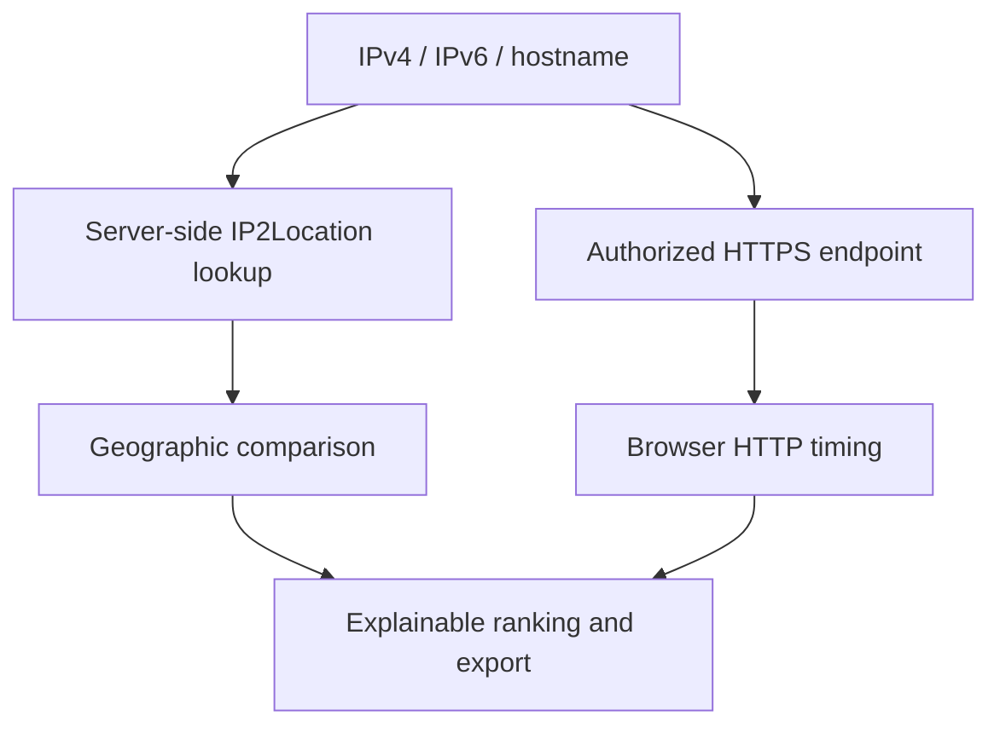

# SakuraTH GeoIP2Route

Compare IP locations, rank geographic fit, and verify candidate HTTPS response times — with the evidence kept separate.

A continuation of [SakuraTH GeoIP2Map](https://github.com/timor2542/sakurath-geoip2map). The original maps an IP; GeoIP2Route lets you select two IPs to compare, or use the same list to assess server candidates. “Route” means choosing a candidate, **not discovering router hops or changing network routing**.

## Why GeoIP2Route

Most IP maps stop after placing an address on a map. GeoIP2Route turns that location into an explainable comparison workflow: add IPv4/IPv6 candidates, compare any pair, rank geographic fit, separately measure browser HTTP response time, inspect every score contribution, and export the evidence. It never presents geographic distance as measured network latency.

**Contest release candidate: v1.8.0.** Automated checks and the production build pass. Live API, deployed rate-limit activation, browser layout, repository publication and the public demo must still be verified by the release owner before submission; see the [release checklist](docs/RELEASE-CHECKLIST.md).



## เริ่มลองใน 1 นาที

1. ติดตั้ง Node.js รุ่นที่รองรับ: 20.19+ หรือ 22.12+ (แนะนำรุ่น LTS ที่ยังได้รับการดูแล)
2. แตก ZIP แล้วเปิด `START-DEMO.bat` บน Windows
3. กด **ลองเดโม — ข้อมูลจำลอง** — สิงคโปร์อยู่ใกล้กรุงเทพฯ กว่า แต่โตเกียวมีเวลา HTTP จำลองเร็วกว่า
4. เปลี่ยนแท็บเป็น **เปรียบเทียบ IP** แล้วเลือกจุด A/B บนแผนที่หรือในรายการ
5. ทดลอง API จริงด้วย `START-LIVE.bat` แล้วกรอก IP2Location.io API Key ของคุณ

เดโมมีข้อมูลในตัว ไม่ต้องมี API Key แต่การติดตั้งครั้งแรก แผนที่ OSM และฟอนต์ต้องใช้อินเทอร์เน็ต ข้อมูลเดโมและเวลาจำลองไม่ใช่ผลการวัดจริง

## Contest safeguards — 1.8.0

- Netlify code-based limits protect the two quota-consuming functions per visitor and domain: 60 lookups/minute and 20 current-IP requests/minute. Netlify must confirm both rules in the first deployment log.
- Successful IP2Location results use a 15-minute, 500-entry warm-instance cache, reducing repeated upstream calls without persisting a user list or exposing the server-side key.
- A platform `429` response becomes a clear wait-and-retry message in the app.
- The test suite is portable across whole-hour, half-hour and 45-minute time zones.
- GitHub Actions runs installation, all checks and the production build for every push and pull request.
- `CHECK-CONTEST-READY.bat` repeats the complete automated release check on Windows.

## Activity Console in the web app — 1.7.0

- The bottom-center **Activity Console / คอนโซลกิจกรรม** records actions performed in this browser: IP2Location lookups, current-IP detection, refresh and bulk progress, A/B selection, deletion, HTTPS measurement and export.
- It opens by default, follows EN/TH, auto-scrolls, keeps at most 200 entries and can be collapsed or cleared. The open/collapsed preference is remembered; log contents reset when the page reloads.
- The console is read-only. It shows IPs/hostnames needed to identify a task, but never intentionally logs API keys or probe URLs. Key/token-like values in error details are redacted before rendering.
- This is a browser activity view, not a live stream of the server process. Detailed resolve/IP2Location/response stages remain in the Terminal that runs the local server.

## Clear demo and live labels — 1.6.3

- **Try Demo — Simulated Data / ลองเดโม — ข้อมูลจำลอง** opens the bundled simulation. The note below explains that no API key is needed and introduces “nearest ≠ fastest.”
- **Load Live Test Example / โหลดตัวอย่างทดสอบจริง** loads the real-test example. Its note clarifies that location lookup needs an API key and HTTP measurement starts only when requested.
- Both notes stay visible and are linked to their buttons for assistive technology. Button behavior, Sakura colors and Niramit typography are unchanged.

## Full IP display — 1.6.2

- IPv4 and IPv6 addresses use full, wrapping text in the point list, A/B cards, server results, reference-IP picker, selected-server details and map tooltips. Long addresses are not replaced by an ellipsis or reduced to tiny type.
- The reference-IP picker displays each address on its own wrapping line. Open it with Enter/Space, Tab through its options, select with Enter/Space, or press Escape to close.
- Single-IP and probe-URL fields grow vertically to fit long values. Press Enter to submit as before; IME composition is not submitted prematurely. Bulk input wraps long lines too.
- Wrapping does not add characters, whitespace or line breaks to stored/exported addresses. Standard IPv6 zero compression (`::`) remains valid and unchanged; this release removes visual clipping, not canonical address normalization.
- Sakura colors, Niramit typography and duplicate-IP protection remain unchanged.

## Duplicate-IP fix — 1.6.1

- IPv6 compressed/expanded forms and letter case use the same canonical address, including API responses and Add current IP.
- Refresh merges points if their hostnames now resolve to the same IP. Manual entry, current-IP insertion and bulk import share the same final duplicate cleanup.
- The surviving point keeps its first-seen ID. A/B selections and the ranking reference are remapped to it. If A and B become one IP, only one selection remains; choose another point to compare.
- Live geography takes precedence over bundled sample geography. A configured probe stays together with its hostname and recorded measurement; if duplicate points have different configured probes, the first configured probe wins. The list represents unique IPs, not multiple independent URLs sharing an IP.
- Manual duplicates report that the existing point was updated. Refresh reports how many duplicate entries were merged. Failed lookups retain the previous data.

## Current IP and API progress — 1.6.0

- **เพิ่ม IP ปัจจุบัน / Add current IP** appears in both workspaces. It performs a live lookup, adds the result to the map, and selects it as point A and the geographic ranking reference.
- If that IP already exists, its location is updated without a duplicate or loss of its configured probe URL. Failure shows an error; no bundled example is substituted for your IP.
- The page shows a loading indicator while waiting for a single response. Bulk import and refresh show completed requests / total, counting both successes and failures.
- The development terminal shows an animated spinner, elapsed time, active-request count and a per-request progress bar: resolve/detect → IP2Location → prepare response. Progress advances only when a stage finishes; a failed request never displays 3/3 success. Redirected output and hosted function logs use one line per stage instead of animation.

เปิด `START-LIVE.bat` หรือ `npm run dev` หลังตั้งค่า API Key แล้วกด **เพิ่ม IP ปัจจุบัน** ดูแถบความคืบหน้าได้ในหน้าต่าง Terminal ที่รันโปรแกรมอยู่ ไม่ใช่ Browser Console

Current-IP detection needs a valid server-side IP2Location key even when bundled demo content is displayed. When opened on localhost, the server discovers **the development computer's public egress IP** using `https://ip.ip2location.io/`; browser-only VPNs/proxies may produce a different address. A remote private/LAN client is rejected rather than silently assigned the server's IP. On Netlify, detection uses the platform-provided connection-IP header. VPNs, NAT and proxies can affect the address, and location remains approximate.

These bars report request stages or completed requests, not downloaded bytes or estimated remaining time. Server-stage logs omit IPs, hostnames, API keys and raw upstream URLs. The in-page Activity Console identifies browser actions with their target IP/hostname but filters key/token-like values and never prints probe URLs.

## Disabled buttons — 1.5.3

Disabled buttons use a light-gray background and dark-gray labels/icons in both themes, without opacity fading or hover shadows. Enabled buttons retain their existing colors.

## Button labels — 1.5.2

Solid Sakura-pink buttons now use white text/icons in both themes. The existing pink palette, outlined buttons and readable Niramit sizes are retained.

## Readability update — 1.5.1

Distances use full grouped kilometres (for example 1,426 km or 14,000 km), not compact k notation. Tables and primary controls use 16px text at default settings, supporting details use 14px, and long IP/network names wrap instead of being cut off. Niramit and the Sakura palette are unchanged.

## What is new in 1.5

- Separate **Geographic fit**, **Browser HTTP**, and clearly labelled **Simulated HTTP** ranking.
- Configure a matching public HTTPS URL for each candidate; measure three requests on demand.
- Median response-header timing, successful/attempted request counts, timestamp and failure reasons.
- Explain the exact score contributions and lead over the second candidate.
- No invented timings for untested URLs; failed probes stay visible and unranked, not “offline.”
- A no-key, nearest-versus-fastest simulation and a live HTTPS example.
- JSON/CSV ranking exports include evidence, formula, measurement origin and geographic source.
- Existing Sakura pink light/dark themes, Niramit typography, EN/TH sliding selector, large menu icons and per-IP deletion remain.

## Two workflows, one IP list

| Workflow | What you select | What it shows |
|---|---|---|
| IP Compare | Any two points A/B | Geographic distance, city/country, ISP, ASN, timezone and network type |
| Server Ranking: geographic | One reference IP | Location-based candidate suitability |
| Server Ranking: Browser HTTP | Candidate HTTPS URLs | Response times from **the browser running this app** |
| Simulated HTTP demo | Bundled synthetic scenario | How measured evidence can change a geographic recommendation |

There is no country allowlist. Add supported public IPv4/IPv6 addresses or hostnames, paste a list, or import CSV/TXT. Each import accepts up to 200 unique targets and files up to 1 MiB. The app does not claim to list every IP in a country: **Update from IP2Location refreshes the IPs you have added**, not an IP2Location-wide directory.

Eight bundled geographic samples are labelled SAMPLE until successfully refreshed. IP2Location supplies the fields available to your API plan; unavailable ISP/usage-type fields remain blank. Anycast locations can change and do not prove which physical server handled a request.

## Terminal quick start

```bash
npm ci
npm run dev
```

Open the local address printed by Vite. Demo content is available without a key.

For live lookups, create `.env.local`:

```env
IP2LOCATION_API_KEY=YOUR_KEY
VITE_DEMO_MODE=false
```

Restart the dev server after changing this file. Never prefix the key with `VITE_`, commit it, include it in a ZIP, or paste it into a probe URL. The Windows live launcher writes the key to this local file while retaining unrelated settings; the demo launcher does not erase an existing key.

The included `dist/` is built frontend output. Do not open `index.html` with `file://`. A static preview can show the bundled demo, but **live lookups require the Vite middleware or Netlify Functions**.

## Measuring actual HTTPS responses

1. Add the hostname of an endpoint you own, or choose **Load Live Test Example**.
2. Import/resolve it through IP2Location (requires a valid key and available quota).
3. Open Server Ranking; choose a reference other than the candidate you will test.
4. Select that candidate and set its public HTTPS probe URL.
5. Press **Save & measure**, or **Measure configured URLs** for the configured list.

A small endpoint that returns HTTP 200/204 and allows CORS is ideal. See [examples/probe-worker.js](examples/probe-worker.js). Probe hostnames must match the selected candidate's target/hostname/IP; redirects, credentials, custom ports, and literal private/reserved addresses are rejected. Use only endpoints you own or are authorized to test. Hostname checks are not a DNS-based security boundary; the browser's own network protections still apply.

The example uses Google's public DNS JSON endpoint: `https://dns.google/resolve?name=example.com&type=A`. It is a functional example, not a geographic benchmark or uptime promise. Importing it does not start HTTP measurement automatically.

A run sends three credential-free GETs per URL, with a 4.5-second timeout per request and at most two candidates in parallel. Measurements stop at response headers; they may include DNS, TCP/TLS setup and server processing. A successful response is not an availability guarantee. CORS/network/TLS failures are not proof that a server is offline.

**Changing the reference IP does not relocate the browser.** HTTP scores never incorporate distance from that arbitrary reference. DNS/CDNs may connect to a different IP from the IP2Location-resolved address.

## Transparent scoring

| Basis | Primary signal (80%) | Secondary signal (20%) |
|---|---|---|
| Geographic fit | Great-circle distance score | Network-type preference |
| Browser HTTP | Successful requests' median response-header time | Network-type preference |
| Simulated HTTP | Explicitly synthetic median HTTP time | Network-type preference |

Scores are 0–100 product heuristics, **not percentages, probabilities, or validated performance predictions**. No successful HTTP measurements means no HTTP rank. One successful request can provide a score, but its low sample count is displayed; repeat and compare equivalent endpoints before making decisions.

Full equations and limitations: [ALGORITHM.md](docs/ALGORITHM.md).

## Bulk input

Plain lists accept one IP/hostname per line, or comma/semicolon/space separators. CSV accepts a target/IP/hostname column and optional matching probe URL:

```csv
target,probe_url
dns.google,https://dns.google/resolve?name=example.com&type=A
```

CSV column order is flexible. The import review matches headers such as `target`, `ip`, `ip_address`, `hostname` or `host`, then shows the detected role of every column, the first three data rows, valid/invalid row counts and exact row numbers that need attention. Common country, region, city, coordinate, ISP, ASN, usage-type and timezone columns appear as reference-only context; live geography still comes from IP2Location during import. Unknown columns are clearly marked as not imported, and the import button remains disabled until the required pattern and every row are valid. File inspection happens locally in the browser and does not start an IP lookup.

Use [sample-data/ip-list.csv](sample-data/ip-list.csv) to see IP plus reference country/city detection, and [sample-data/endpoints.csv](sample-data/endpoints.csv) for the HTTPS example. Existing IPs are deduplicated; importing a probe for an existing IP updates its configuration and clears its old measurement. Invalid CSV is rejected before lookup. A failed lookup does not discard successful entries.

## Deployment

This ZIP does not create a repository or publish a site. To deploy with the supplied Netlify configuration:

1. Create your new GitHub repository and upload source, excluding `.env.local`, `node_modules`, and local secrets.
2. Connect the repository to Netlify.
3. Set the server-side `IP2LOCATION_API_KEY` in its environment.
4. Use build command `npm run build`, publish directory `dist`, and functions directory `netlify/functions`.

The functions include Netlify code-based per-IP/domain rate limits. Verify that the deploy log recognizes both rules; a valid rule is deployment configuration, not an absolute account-wide quota guarantee. The app also caches successful geolocations for 15 minutes within a warm function instance. Monitor the IP2Location quota and tighten the static limits if the public demo attracts abuse. Static GitHub Pages alone cannot run the included lookup functions.

## Privacy and limitations

- IPs/hostnames submitted for lookup go to the app server; hostnames use its DNS resolver, and resolved IPs go to IP2Location.
- Pressing Add current IP on localhost contacts IP2Location's public-IP discovery service from the development computer before geolocation. It is never called automatically on page load.
- Explicit HTTP measurements contact the selected endpoint from your browser; it sees the browser's network address.
- OSM map tiles and Google Fonts make ordinary external requests. The dark map is a local visual filter on OSM tiles, not a second paid map service.
- The list and measurements live in page memory and reset on reload. Only language/theme/workspace preferences use localStorage. Exports save the selected data to your device.
- This app does not maintain a lookup database. Hosting providers and upstream services may keep their own logs.
- IP location is approximate, not GPS. Geographic lines are not network paths. This tool does not perform ICMP ping, traceroute, load balancing, failover or remote-agent testing.

## Verify and demonstrate

```bash
npm run check
npm run build
```

The check runs a structural smoke check and 45 automated tests, covering ranking, imports, disabled-button CSS, API progress stages, concurrent terminal output, current-IP validation, canonical IPv6 identity, refreshed DNS collisions, selection remapping, address wrapping, Activity Console rendering/responsiveness, mobile demo handoff, dialog accessibility, secret redaction, action wiring, rate-limit declarations, cache behavior and `429` handling. Page-action tests execute the actual application functions with mock responses; they are not browser tests. Markup rendering does not verify pixel layout. HTTP, DNS and upstream API tests use mocks; they do not certify live provider access, current geolocation, endpoint availability, deployed rule activation or rendered layout.

[90-second demo guide](docs/DEMO-GUIDE.md) · [Submission copy](docs/SUBMISSION.md) · [Release checklist](docs/RELEASE-CHECKLIST.md) · [Validation](docs/VALIDATION.md) · [Changelog](CHANGELOG.md)

## License and attribution

MIT © 2026 Krittamet Thawong. Retain the original project attribution and LICENSE when publishing the successor. Map attribution remains visible in the app: OpenStreetMap contributors. Niramit is loaded through Google Fonts.

Technical references: [Fetch behavior](https://developer.mozilla.org/en-US/docs/Web/API/Fetch_API/Using_Fetch), [opaque responses](https://developer.mozilla.org/en-US/docs/Web/API/Response/type), [Google DNS JSON API](https://developers.google.com/speed/public-dns/docs/doh/json).
