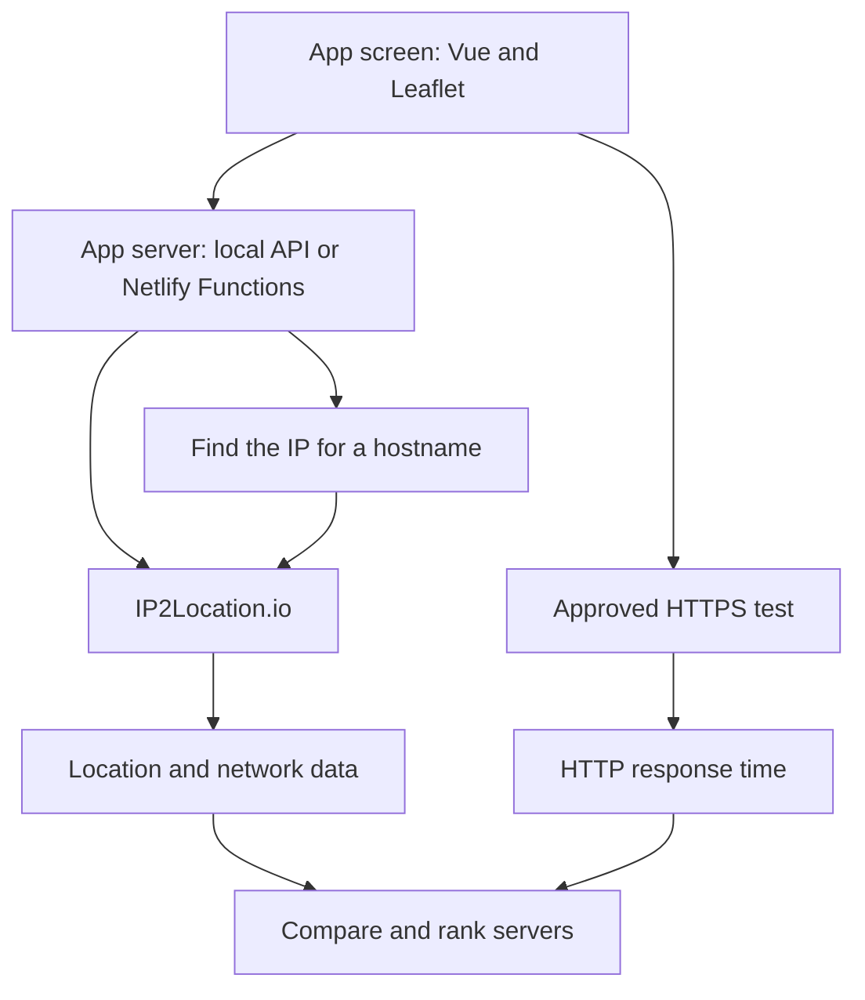

# SakuraTH GeoIP2Route

**English** | [ภาษาไทย](README.th.md)

> Explainable Geo-Aware Server Ranking

A bilingual web application for comparing IP locations and ranking server candidates with IP2Location.io. It keeps **map distance** clearly separate from **HTTP response time measured by the browser**.

Built for the **IP2Location Programming Contest 2026** · Version **1.8.0**

GeoIP2Route continues [SakuraTH GeoIP2Map](https://github.com/timor2542/sakurath-geoip2map). The original project maps one IP; GeoIP2Route adds pairwise A/B comparison and multi-server ranking. “Route” means selecting a suitable server candidate—it does not discover router hops or change network routing.

## Highlights

- Accepts public IPv4, IPv6, and hostnames
- Compares two IPs with distance, country, city, ISP, ASN, timezone, and network type
- Ranks server candidates by geographic fit or measured browser HTTP timing
- Explains every score and never invents a speed value when no measurement exists
- Imports plain text, CSV, or TXT with column and row validation before lookup
- Deduplicates equivalent addresses, including differently written IPv6 addresses
- Exports ranking evidence as JSON or CSV
- Includes an in-page Activity Console for the current browser session
- Supports English/Thai, light/dark themes, and keyboard navigation

## Quick start (live mode)

1. Install [Node.js](https://nodejs.org/) `20.19+` or `22.12+`.
2. Install the dependencies:
```bash
npm ci
```
3. Start the app:
```bash
npm run dev
```
4. Open the local URL printed by Vite, usually `http://localhost:5173/`. Vite automatically chooses another port when that port is busy.

## How to use it

### Compare two IPs

1. Open **IP Compare**.
2. Add addresses with the input field, Paste List, Import CSV, or **Add current IP**.
3. Select markers or list rows to assign points **A** and **B**.
4. Inspect the connecting line, distance, and network details in the right panel.

**Clear A/B** clears only the current selection; it does not delete points. The per-row trash button and **Delete all** ask for confirmation before removing data.

### Rank server candidates

1. Open **Server Ranking**.
2. Choose one IP as the source.
3. Every other IP in the shared list automatically becomes a candidate.
4. Review geographic ranking, or add Probe URLs to measure real browser HTTP timing.
5. Open a result to inspect its score, distance, timing, and ranking evidence.
6. Export the results as JSON or CSV when ready.

The nearest server is not always the fastest. Compare both ranking views when you need to choose between geographic fit and observed browser response time.

## CSV import

Column order is flexible. The importer identifies columns by their headers and shows a review screen before any lookup begins.

| Type | Accepted headers | Use |
|---|---|---|
| IP or hostname | `target`, `ip`, `ip_address`, `address`, `hostname`, `host` | Exactly one is required |
| Probe URL | `probe_url`, `probe`, `health_url` | Optional |
| Reference metadata | Country, city, region, latitude, longitude, ISP, ASN, usage type, timezone | Preview only |

Minimal example:

```csv
target,probe_url
dns.google,https://dns.google/resolve?name=example.com&type=A
```

The required IP column may appear anywhere:

```csv
country_name,city_name,ip
Thailand,Bangkok,203.144.207.29
Singapore,Singapore,165.21.83.88
```

The review screen shows each detected column role, the first three rows, valid and invalid counts, and the exact row numbers that need attention. File inspection occurs locally in the browser and does not contact IP2Location.

- Maximum 200 unique entries per import
- Maximum file size: 1 MiB
- Existing addresses are merged instead of duplicated
- Importing a Probe URL for an existing address updates its configuration and clears its old measurement
- Location columns are reference-only; live geography is verified with IP2Location during import

Try [ip-list.csv](sample-data/ip-list.csv), [endpoints.csv](sample-data/endpoints.csv), or the regional examples in [sample-data/README.md](sample-data/README.md): Asia-Pacific, Europe, the Americas, and Africa/Middle East.

**Add current IP** runs only when the user presses it. On localhost, the server detects the development computer's public egress IP. On Netlify, it uses the platform-provided connection IP. VPNs, proxies, and NAT can change the detected address or location.

## Measure real HTTP responses

Only test HTTPS endpoints that you own or are authorized to use.

1. Add the server's hostname or IP.
2. Enter a public HTTPS Probe URL whose host matches that candidate.
3. Select **Save & measure** or **Measure configured URLs**.
4. The app sends three GET requests and uses the median time to response headers.

An ideal endpoint returns `200` or `204`, allows CORS, and has a small response. See [probe-worker.js](examples/probe-worker.js) for an example.

The reported time can include DNS, TCP/TLS, and server processing. It is not ICMP ping or traceroute. A failed browser request may indicate CORS, TLS, or network policy—not necessarily an offline server.

## How scoring works

| Mode | Primary signal (80%) | Secondary signal (20%) |
|---|---|---|
| Geographic Fit | Great-circle distance | Network-type preference |
| Browser HTTP | Successful requests' median response time | Network-type preference |

Scores from 0–100 are project heuristics, not speed percentages, probabilities, or validated performance predictions. Without a successful HTTP request, the app does not create an HTTP rank.

See [ALGORITHM.md](docs/ALGORITHM.md) for the complete equations, assumptions, and limitations.

## How the system works

GeoIP2Route uses two separate data paths. Location requests go through the app server, so the IP2Location API key is not exposed in the browser. Approved HTTPS tests run in the user's browser. The app then uses both results to compare and rank servers.



| Path | Purpose |
|---|---|
| `src/` | App screen, map, file import, and ranking |
| `server/` | Local API server for development |
| `netlify/functions/` | Online functions for IP lookups and current-IP detection |
| `sample-data/` | Example CSV files |
| `scripts/` | Tests and local start tools |
| [docs/](docs/) | Algorithm details and user guides |

## Privacy and limitations

- IP geolocation is approximate, not GPS; Anycast addresses may resolve to different network locations.
- Lines on the map show geographic relationships, not packet routes.
- HTTP timing comes from the browser running the app, not from the source IP selected on the map.
- IPs and hostnames submitted for lookup pass through the app server; resolved IPs are sent to IP2Location.
- A requested probe is contacted by the browser and can see the browser's network address.
- The IP list and measurements live in page memory and reset on reload. Only language, theme, and workspace preferences use `localStorage`.
- OpenStreetMap tiles and Google Fonts make ordinary external requests.

## License and attribution

[MIT License](LICENSE) © 2026 Krittamet Thawong

Map data © OpenStreetMap contributors · IP geolocation powered by IP2Location.io · Niramit font via Google Fonts
