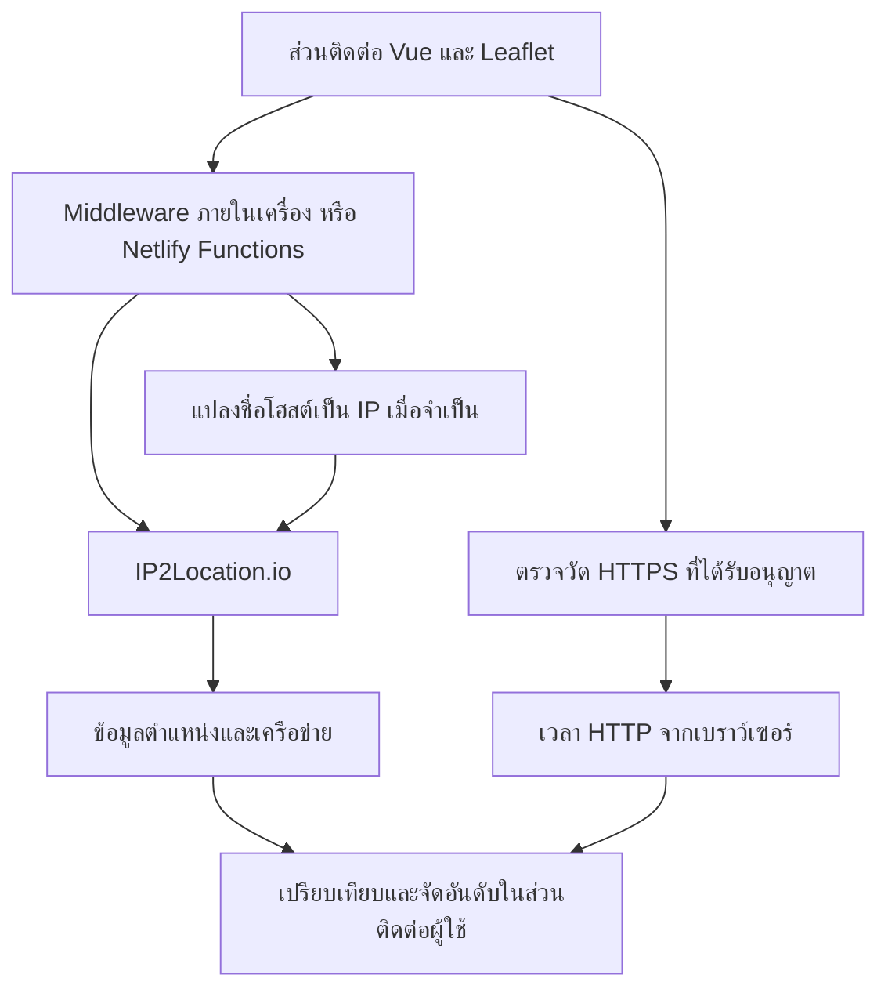

# SakuraTH GeoIP2Route

[English](README.md) | **ภาษาไทย**

> การจัดอันดับเซิร์ฟเวอร์จากข้อมูลภูมิศาสตร์แบบอธิบายได้

เว็บแอปพลิเคชันสองภาษา (ไทย/อังกฤษ) สำหรับเปรียบเทียบตำแหน่งของ IP และจัดอันดับเซิร์ฟเวอร์ โดยใช้ข้อมูลจาก IP2Location.io พร้อมแยก **ระยะทางบนแผนที่** ออกจาก **เวลาตอบสนอง HTTP ที่ตรวจวัดจากเบราว์เซอร์** อย่างชัดเจน

พัฒนาสำหรับ **IP2Location Programming Contest 2026** · เวอร์ชัน **1.8.0**

**สรุป:** เปรียบเทียบตำแหน่ง IPv4/IPv6 จัดอันดับเซิร์ฟเวอร์ตามความเหมาะสมทางภูมิศาสตร์ ตรวจวัดเวลา HTTPS จากเบราว์เซอร์เมื่อได้รับอนุญาต ตรวจสอบที่มาของคะแนน และส่งออกผลลัพธ์ โดยไม่แสดงระยะทางทางภูมิศาสตร์เป็นค่าเวลาเครือข่ายที่ตรวจวัดจริง

โครงการนี้ต่อยอดจาก [SakuraTH GeoIP2Map](https://github.com/timor2542/sakurath-geoip2map) ซึ่งแสดงตำแหน่งของ IP หนึ่งรายการ ส่วน GeoIP2Route เพิ่มการเปรียบเทียบ A/B และการจัดอันดับเซิร์ฟเวอร์หลายรายการ คำว่า “Route” ในบริบทนี้หมายถึงการเลือกเซิร์ฟเวอร์ที่เหมาะสม มิใช่การค้นหาจุดเชื่อมต่อของเราเตอร์หรือการเปลี่ยนเส้นทางเครือข่าย

## จุดเด่น

- รองรับ IPv4 สาธารณะ, IPv6 และชื่อโฮสต์
- เปรียบเทียบ IP สองจุดบนแผนที่ พร้อมแสดงระยะทาง ประเทศ เมือง ISP, ASN, เขตเวลา และประเภทเครือข่าย
- จัดอันดับเซิร์ฟเวอร์จากความเหมาะสมเชิงภูมิศาสตร์ หรือเวลาตอบสนอง HTTP ที่ตรวจวัดจากเบราว์เซอร์
- แสดงที่มาของคะแนนอย่างโปร่งใส และไม่สร้างค่าความเร็วขึ้นเองเมื่อยังไม่มีการตรวจวัด
- นำเข้ารายการจากข้อความ, CSV หรือ TXT พร้อมหน้าตรวจสอบคอลัมน์และแถวที่ไม่ถูกต้องก่อนเริ่มค้นหาข้อมูล
- ป้องกัน IP ซ้ำ รวมถึง IPv6 ที่เขียนต่างรูปแบบแต่เป็นหมายเลขเดียวกัน
- ส่งออกผลการจัดอันดับเป็น JSON และ CSV
- มีบันทึกกิจกรรมสำหรับติดตามการทำงานภายในเซสชันของเบราว์เซอร์
- รองรับภาษาไทย/อังกฤษ ธีมสว่าง/มืด และการใช้งานด้วยคีย์บอร์ด

## เริ่มใช้งานในโหมดข้อมูลจริง

1. ติดตั้ง [Node.js](https://nodejs.org/) รุ่น `20.19+` หรือ `22.12+`
2. ติดตั้งแพ็กเกจที่จำเป็น:
```bash
npm ci
```
3. เริ่มระบบ:
```bash
npm run dev
```
4. เปิด URL ภายในเครื่องที่ Vite แสดงในเทอร์มินัล เช่น `http://localhost:5173/` หากพอร์ตดังกล่าวถูกใช้งานอยู่ Vite จะเลือกพอร์ตอื่นโดยอัตโนมัติ

## วิธีใช้งาน

แถบด้านซ้ายจัดส่วนที่ใช้งานจริงไว้ก่อนตามลำดับ ได้แก่ **Add current IP**, **Update list from IP2Location**, **ADD IPs TO THE LIST** และ **MAP POINTS** (หรือ **ALL IP POINTS** ในโหมดจัดอันดับเซิร์ฟเวอร์) ส่วนปุ่มสาธิตสองปุ่มอยู่ท้ายแถบด้านซ้าย

บนหน้าจอเดสก์ท็อป ตัวเลือกโหมดเปรียบเทียบ/จัดอันดับจะอยู่บนแถบด้านบน ส่วน **การนำทางด่วน** จะเป็นแถบไอคอนขนาดเล็กริมซ้ายสุด ไอคอนทั้งห้ารายการใช้สำหรับไปยัง IP ปัจจุบัน การปรับปรุงข้อมูล การเพิ่ม IP รายการจุด และส่วนสาธิต โดยค่าเริ่มต้นจะแสดงเฉพาะไอคอน และสามารถกดไอคอนเมนูด้านบนเพื่อขยายแถบให้แสดงชื่อทั้งหมดได้ แถบควบคุมหลักจึงเริ่มต้นด้วยส่วนที่ใช้งานจริง สำหรับหน้าจอขนาดกลาง ปุ่มหัวข้อจะอยู่บนแถบด้านบน และหน้าจอมือถือจะแสดงเมนูแนวตั้งภายในแถบซ้าย

### 1. เปรียบเทียบ IP สองจุด

1. เลือกแท็บ **IP Compare / เปรียบเทียบ IP**
2. เพิ่ม IP ผ่านช่องกรอก ปุ่ม **Paste list**, **Import CSV** หรือ **Add current IP**
3. เลือกหมุดหรือรายการ IP เพื่อกำหนดจุด **A** และ **B**
4. ตรวจสอบเส้นเชื่อม ระยะทาง และข้อมูลเครือข่ายในแถบด้านขวา

ปุ่ม **Clear A/B / ล้าง A/B** จะล้างเฉพาะจุดที่เลือกโดยไม่ลบ IP ออกจากรายการ ส่วนปุ่มถังขยะและ **Delete all / ลบทั้งหมด** จะแสดงหน้าต่างยืนยันก่อนดำเนินการ

### 2. จัดอันดับเซิร์ฟเวอร์

1. เลือกแท็บ **Server Ranking / จัดอันดับเซิร์ฟเวอร์**
2. เลือก IP หนึ่งรายการเป็นจุดอ้างอิง
3. ระบบจะกำหนดให้ IP ที่เหลือเป็นเซิร์ฟเวอร์ที่เป็นตัวเลือกโดยอัตโนมัติ
4. ตรวจสอบอันดับจากตำแหน่งทางภูมิศาสตร์ หรือเพิ่ม URL สำหรับตรวจวัดเพื่อวัด HTTP จริง
5. เปิดรายละเอียดเพื่อตรวจสอบคะแนน ระยะทาง เวลา และเหตุผลของอันดับ
6. ส่งออกผลลัพธ์เป็น JSON หรือ CSV ได้เมื่อพร้อม

จุดที่อยู่ใกล้ที่สุดอาจมิใช่จุดที่ตอบสนองเร็วที่สุด จึงควรพิจารณาทั้งความเหมาะสมเชิงภูมิศาสตร์และเวลา HTTP ที่ตรวจวัดจากเบราว์เซอร์ก่อนเลือกเซิร์ฟเวอร์

## การนำเข้า CSV

ลำดับคอลัมน์ไม่จำเป็นต้องตายตัว ระบบจะอ่านจากชื่อหัวคอลัมน์และแสดงหน้าตรวจสอบก่อนนำเข้าข้อมูล

คอลัมน์ที่ใช้ได้:

| ประเภท | ชื่อหัวคอลัมน์ที่รองรับ | การใช้งาน |
|---|---|---|
| IP หรือชื่อโฮสต์ | `target`, `ip`, `ip_address`, `address`, `hostname`, `host` | จำเป็นต้องมีหนึ่งคอลัมน์ |
| URL สำหรับตรวจวัด | `probe_url`, `probe`, `health_url` | ไม่บังคับ |
| ข้อมูลอ้างอิง | ประเทศ เมือง ภูมิภาค ละติจูด ลองจิจูด ISP, ASN, ประเภทการใช้งาน และเขตเวลา | แสดงในหน้าตัวอย่างเท่านั้น |

ตัวอย่างพื้นฐาน:

```csv
target,probe_url
dns.google,https://dns.google/resolve?name=example.com&type=A
```

ตัวอย่างที่มีคอลัมน์อ้างอิงและเรียง IP ไว้ท้ายสุด:

```csv
country_name,city_name,ip
Thailand,Bangkok,203.144.207.29
Singapore,Singapore,165.21.83.88
```

ก่อนเลือกนำเข้า หน้าตัวอย่างจะแสดงบทบาทของแต่ละคอลัมน์ ตัวอย่างสามแถวแรก จำนวนแถวที่ถูกต้องหรือไม่ถูกต้อง และหมายเลขแถวที่ต้องแก้ไข ขั้นตอนนี้ดำเนินการภายในเบราว์เซอร์และยังไม่มีการส่งคำขอค้นหาข้อมูลไปยัง IP2Location

- รองรับสูงสุด 200 รายการที่ไม่ซ้ำต่อครั้ง
- ขนาดไฟล์สูงสุด 1 MiB
- รายการเดิมจะถูกรวมโดยไม่สร้าง IP ซ้ำ
- หากนำเข้า URL สำหรับตรวจวัดให้แก่รายการเดิม ระบบจะปรับปรุง URL และล้างผลการตรวจวัดเดิม
- คอลัมน์ประเทศและตำแหน่งใน CSV เป็นข้อมูลอ้างอิง ระบบจะตรวจสอบตำแหน่งอีกครั้งด้วย IP2Location ระหว่างนำเข้า

ไฟล์ทดลอง: [ip-list.csv](sample-data/ip-list.csv), [endpoints.csv](sample-data/endpoints.csv) และไฟล์แยกตามภูมิภาคใน [sample-data/README.md](sample-data/README.md): เอเชียแปซิฟิก ยุโรป อเมริกา และแอฟริกา/ตะวันออกกลาง

ปุ่ม **Add current IP** จะตรวจหา IP สาธารณะของการเชื่อมต่อเมื่อผู้ใช้เลือกปุ่มเท่านั้น เมื่อทำงานภายในเครื่อง ระบบจะใช้ IP สาธารณะขาออกของเครื่องที่เรียกใช้เซิร์ฟเวอร์พัฒนา ส่วนบน Netlify จะใช้ IP การเชื่อมต่อที่แพลตฟอร์มส่งให้ การใช้ VPN, พร็อกซี หรือ NAT อาจทำให้ IP หรือตำแหน่งที่แสดงเปลี่ยนแปลง

## การวัด HTTP จริง

โปรดใช้เฉพาะปลายทาง HTTPS ที่ท่านเป็นเจ้าของหรือได้รับอนุญาตให้ทดสอบ

1. เพิ่มชื่อโฮสต์หรือ IP ของเซิร์ฟเวอร์
2. ระบุ HTTPS URL สาธารณะสำหรับตรวจวัด โดยชื่อโฮสต์ต้องตรงกับเซิร์ฟเวอร์ที่เป็นตัวเลือก
3. เลือก **Save & measure** หรือ **Measure configured URLs**
4. ระบบจะส่งคำขอ GET จำนวน 3 ครั้ง และใช้ค่ามัธยฐานของเวลาจนได้รับส่วนหัวการตอบกลับ

ปลายทางควรตอบกลับด้วยสถานะ `200` หรือ `204` รองรับ CORS และมีการตอบกลับขนาดเล็ก ตัวอย่าง Worker อยู่ที่ [probe-worker.js](examples/probe-worker.js)

เวลาที่แสดงอาจรวม DNS, TCP/TLS และการประมวลผลของเซิร์ฟเวอร์ จึงมิใช่ ICMP Ping หรือ Traceroute การเชื่อมต่อที่ไม่สำเร็จอาจเกิดจาก CORS, TLS หรือนโยบายเครือข่าย และมิได้ยืนยันว่าเซิร์ฟเวอร์หยุดให้บริการ

## คะแนนคำนวณอย่างไร

| โหมด | สัญญาณหลัก 80% | สัญญาณเสริม 20% |
|---|---|---|
| ความเหมาะสมเชิงภูมิศาสตร์ | ระยะทางวงกลมใหญ่ | ความเหมาะสมของประเภทเครือข่าย |
| HTTP จากเบราว์เซอร์ | ค่ามัธยฐานของเวลาตอบสนอง HTTP ที่ตรวจวัดสำเร็จ | ความเหมาะสมของประเภทเครือข่าย |

คะแนน 0–100 เป็นเกณฑ์เปรียบเทียบของโครงการ มิใช่ร้อยละของความเร็ว ความน่าจะเป็น หรือการรับรองประสิทธิภาพ หากไม่มีคำขอ HTTP ที่สำเร็จ ระบบจะไม่สร้างอันดับ HTTP ขึ้นเอง

ศึกษาสมการ ข้อสมมติ และข้อจำกัดทั้งหมดได้ที่ [ALGORITHM.th.md](docs/ALGORITHM.th.md)

## สถาปัตยกรรมและการไหลของข้อมูล

แอปใช้หลักฐานจากสองเส้นทางที่แยกจากกัน การค้นหาตำแหน่งจะดำเนินการผ่าน API ฝั่งเซิร์ฟเวอร์เพื่อเก็บคีย์ IP2Location เป็นความลับ ส่วนการตรวจวัด HTTPS ที่ได้รับอนุญาตจะดำเนินการจากเบราว์เซอร์ของผู้ใช้โดยตรง จากนั้นผลลัพธ์ทั้งสองส่วนจะกลับมายังส่วนติดต่อ Vue เพื่อใช้เปรียบเทียบและจัดอันดับ



| ส่วน | หน้าที่ |
|---|---|
| `src/` | ส่วนติดต่อผู้ใช้ Vue แผนที่ การนำเข้า และตรรกะการจัดอันดับ |
| `server/` | API Middleware สำหรับการพัฒนาภายในเครื่อง |
| `netlify/functions/` | ฟังก์ชันแบบไร้เซิร์ฟเวอร์สำหรับค้นหาข้อมูลและตรวจหา IP ปัจจุบัน |
| `sample-data/` | ไฟล์ CSV สำหรับทดลองนำเข้า |
| `scripts/` | การตรวจสอบอัตโนมัติและเครื่องมือเริ่มระบบ |
| [docs/](docs/) | รายละเอียดอัลกอริทึมและคู่มือการใช้งาน |

## ความเป็นส่วนตัวและข้อจำกัด

- ตำแหน่ง IP เป็นค่าประมาณ มิใช่ GPS และ Anycast IP อาจชี้ไปยังตำแหน่งเครือข่ายที่แตกต่างกัน
- เส้นบนแผนที่แสดงความสัมพันธ์เชิงภูมิศาสตร์ มิใช่เส้นทางของแพ็กเก็ต
- การตรวจวัด HTTP เกิดจากเบราว์เซอร์ที่เปิดแอป มิใช่จาก IP อ้างอิงที่เลือกบนแผนที่
- IP หรือชื่อโฮสต์ที่ค้นหาจะผ่านเซิร์ฟเวอร์ของแอป และ IP ที่แปลงแล้วจะถูกส่งไปยัง IP2Location
- URL สำหรับตรวจวัดที่ผู้ใช้สั่งให้ทดสอบจะถูกเรียกจากเบราว์เซอร์ และปลายทางจะเห็นที่อยู่เครือข่ายของเบราว์เซอร์
- รายการ IP และผลการตรวจวัดอยู่ในหน่วยความจำของหน้าเว็บและจะหายไปเมื่อโหลดหน้าใหม่ มีเฉพาะการตั้งค่าภาษา รูปแบบสี และพื้นที่ทำงานที่จัดเก็บใน `localStorage`
- ไทล์แผนที่จาก OpenStreetMap และแบบอักษรจาก Google Fonts มีการเชื่อมต่อภายนอกตามการทำงานปกติ

## สัญญาอนุญาตและการระบุแหล่งที่มา

[MIT License](LICENSE) © 2026 Krittamet Thawong

Map data © OpenStreetMap contributors · IP geolocation powered by IP2Location.io · Niramit font via Google Fonts
