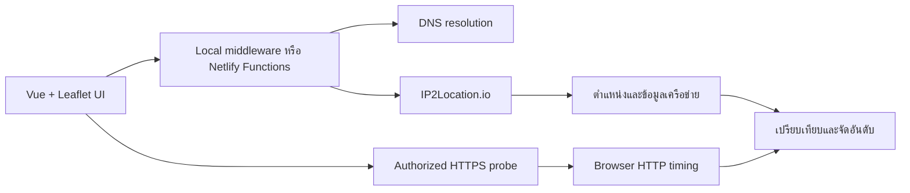

# SakuraTH GeoIP2Route

[English](README.md) | **ภาษาไทย**

> Explainable Geo-Aware Server Ranking

เว็บแอปสองภาษา (ไทย/อังกฤษ) สำหรับเปรียบเทียบตำแหน่งของ IP และช่วยจัดอันดับเซิร์ฟเวอร์ โดยใช้ข้อมูลจาก IP2Location.io พร้อมแยก **ระยะทางบนแผนที่** ออกจาก **เวลา HTTP ที่วัดจากเบราว์เซอร์** อย่างชัดเจน

พัฒนาสำหรับ **IP2Location Programming Contest 2026** · เวอร์ชัน **1.8.0**

**English summary:** Compare IPv4/IPv6 locations, rank server candidates by geographic fit, optionally measure authorized HTTPS endpoints from the browser, inspect the score evidence, and export the results. Geographic distance is never presented as measured network latency.

โปรเจกต์นี้ต่อยอดจาก [SakuraTH GeoIP2Map](https://github.com/timor2542/sakurath-geoip2map) ซึ่งแสดงตำแหน่งของ IP เดียว ส่วน GeoIP2Route เพิ่มการเปรียบเทียบ A/B และการจัดอันดับเซิร์ฟเวอร์หลายตัว คำว่า “Route” ในที่นี้หมายถึงการเลือกเซิร์ฟเวอร์ที่เหมาะสม ไม่ใช่การค้นหา Router Hop หรือเปลี่ยนเส้นทางเครือข่าย

## จุดเด่น

- รองรับ Public IPv4, IPv6 และ Hostname
- เปรียบเทียบ IP สองจุดบนแผนที่ พร้อมระยะทาง ประเทศ เมือง ISP, ASN, Timezone และประเภทเครือข่าย
- จัดอันดับเซิร์ฟเวอร์จาก Geographic Fit หรือเวลา HTTP ที่วัดจากเบราว์เซอร์
- แสดงที่มาของคะแนน ไม่ซ่อนสูตรและไม่สร้างค่าความเร็วปลอมเมื่อยังไม่ได้วัด
- นำเข้ารายการจากข้อความ, CSV หรือ TXT พร้อมหน้าตรวจสอบคอลัมน์และแถวที่ผิดก่อนเริ่ม Lookup
- ป้องกัน IP ซ้ำ รวมถึง IPv6 ที่เขียนต่างรูปแบบแต่เป็นหมายเลขเดียวกัน
- ส่งออกผลการจัดอันดับเป็น JSON และ CSV
- มี Activity Console สำหรับติดตามการทำงานใน Browser Session
- รองรับภาษาไทย/อังกฤษ ธีมสว่าง/มืด และการใช้งานด้วยคีย์บอร์ด
- มีโหมด Demo ที่ใช้งานได้โดยไม่ต้องมี API Key

## เริ่มใช้งานแบบเร็วที่สุด

### Windows: ทดลอง Demo

1. ติดตั้ง [Node.js](https://nodejs.org/) รุ่น `20.19+` หรือ `22.12+`
2. ดับเบิลคลิก `START-DEMO.bat`
3. รอให้ติดตั้ง Dependencies และเปิดหน้าเว็บ
4. กด **Try Demo — Simulated Data / ลองเดโม — ข้อมูลจำลอง**

Demo มีข้อมูลตัวอย่างในตัวและไม่ต้องใช้ IP2Location API Key แต่การติดตั้งครั้งแรก แผนที่ OpenStreetMap และ Google Fonts ต้องเชื่อมต่ออินเทอร์เน็ต

### Terminal

```bash
npm ci
npm run dev
```

เปิด Local URL ที่ Vite แสดงใน Terminal เช่น `http://localhost:5173/` หาก Port นี้ถูกใช้งานอยู่ Vite จะเลือก Port อื่นให้อัตโนมัติ

## วิธีใช้งาน

### 1. เปรียบเทียบ IP สองจุด

1. เลือกแท็บ **IP Compare / เปรียบเทียบ IP**
2. เพิ่ม IP ด้วยช่องกรอก, Paste List, Import CSV หรือ **Add current IP**
3. คลิก Marker หรือรายการ IP เพื่อเลือกจุด **A** และ **B**
4. ดูเส้นเชื่อม ระยะทาง และข้อมูลเครือข่ายในแถบด้านขวา

ปุ่ม **Clear A/B / ล้าง A/B** ล้างเฉพาะจุดที่เลือก แต่ไม่ลบ IP ออกจากรายการ ส่วนปุ่มถังขยะและ **Delete all / ลบทั้งหมด** จะถามยืนยันก่อนลบ

### 2. จัดอันดับเซิร์ฟเวอร์

1. เลือกแท็บ **Server Ranking / จัดอันดับเซิร์ฟเวอร์**
2. เลือก IP ต้นทางหนึ่งจุด
3. IP ที่เหลือจะกลายเป็น Server Candidates โดยอัตโนมัติ
4. ดูอันดับจากตำแหน่งทางภูมิศาสตร์ หรือเพิ่ม Probe URL เพื่อวัด HTTP จริง
5. เปิดรายละเอียดเพื่อดูคะแนน ระยะทาง เวลา และเหตุผลที่เซิร์ฟเวอร์นั้นได้อันดับ
6. ส่งออกผลลัพธ์เป็น JSON หรือ CSV ได้เมื่อพร้อม

จุดที่อยู่ใกล้ที่สุดอาจไม่ใช่จุดที่ตอบสนองเร็วที่สุด โหมด Demo เตรียมตัวอย่างสำหรับแสดงความแตกต่างนี้ไว้แล้ว

## การนำเข้า CSV

ลำดับคอลัมน์ไม่ตายตัว ระบบอ่านจากชื่อ Header และแสดงหน้าตรวจสอบก่อนนำเข้าจริง

คอลัมน์ที่ใช้ได้:

| ประเภท | ชื่อ Header ที่รองรับ | การใช้งาน |
|---|---|---|
| IP หรือ Hostname | `target`, `ip`, `ip_address`, `address`, `hostname`, `host` | จำเป็นต้องมีหนึ่งคอลัมน์ |
| Probe URL | `probe_url`, `probe`, `health_url` | ไม่บังคับ |
| ข้อมูลอ้างอิง | ประเทศ เมือง Region, Latitude, Longitude, ISP, ASN, Usage Type, Timezone | แสดงใน Preview เท่านั้น |

ตัวอย่างพื้นฐาน:

```csv
target,probe_url
dns.google,https://dns.google/resolve?name=example.com&type=A
```

ตัวอย่างที่มีคอลัมน์อ้างอิงและเรียง IP ไว้ท้ายสุด:

```csv
country_name,city_name,ip
Thailand,Bangkok,203.144.207.29
Singapore,Singapore,165.21.83.88
```

ก่อนกด Import หน้า Preview จะแสดงบทบาทของแต่ละคอลัมน์ ตัวอย่างสามแถวแรก จำนวนแถวที่ผ่าน/ไม่ผ่าน และเลขแถวที่ต้องแก้ การตรวจไฟล์ขั้นนี้เกิดในเบราว์เซอร์และยังไม่ส่ง Lookup ไปยัง IP2Location

- รองรับสูงสุด 200 รายการที่ไม่ซ้ำต่อครั้ง
- ขนาดไฟล์สูงสุด 1 MiB
- รายการเดิมจะถูกรวมโดยไม่สร้าง IP ซ้ำ
- หากนำเข้า Probe URL ให้รายการเดิม ระบบจะอัปเดต Probe และล้างผลวัดเก่า
- คอลัมน์ประเทศและตำแหน่งใน CSV เป็นข้อมูลอ้างอิง ตำแหน่งจริงจะตรวจใหม่ด้วย IP2Location ตอน Import

ไฟล์ทดลอง: [ip-list.csv](sample-data/ip-list.csv) และ [endpoints.csv](sample-data/endpoints.csv)

## เปิดใช้ IP2Location API จริง

API Key ถูกใช้งานฝั่ง Server เท่านั้น ไม่ถูกฝังใน Frontend Bundle

### Windows

ดับเบิลคลิก `START-LIVE.bat` แล้ววาง IP2Location.io API Key เมื่อโปรแกรมถาม ระบบจะบันทึก Key ไว้ใน `.env.local` บนเครื่องนี้

### ตั้งค่าด้วยตนเอง

สร้างไฟล์ `.env.local`:

```env
IP2LOCATION_API_KEY=YOUR_KEY
VITE_DEMO_MODE=false
```

จากนั้น Restart Development Server

> อย่าเติม `VITE_` หน้า API Key และอย่า Commit `.env.local` ขึ้น Repository เพราะตัวแปรที่ขึ้นต้นด้วย `VITE_` สามารถถูกส่งเข้า Frontend ได้

ปุ่ม **Add current IP** จะตรวจ Public IP ของการเชื่อมต่อเมื่อผู้ใช้กดเท่านั้น บน Localhost ระบบใช้ Public Egress IP ของเครื่องที่รัน Development Server ส่วนบน Netlify ใช้ Connection IP ที่ Platform ส่งให้ VPN, Proxy และ NAT อาจทำให้ IP หรือตำแหน่งที่แสดงเปลี่ยนไป

## การวัด HTTP จริง

ใช้เฉพาะ HTTPS Endpoint ที่คุณเป็นเจ้าของหรือได้รับอนุญาตให้ทดสอบ

1. เพิ่ม Hostname/IP ของเซิร์ฟเวอร์
2. ใส่ Public HTTPS Probe URL ที่ Host ตรงกับ Candidate
3. กด **Save & measure** หรือ **Measure configured URLs**
4. ระบบส่ง GET จำนวน 3 ครั้งและใช้ค่ามัธยฐานของเวลาจนได้รับ Response Headers

Endpoint ควรตอบ `200` หรือ `204`, รองรับ CORS และมี Response ขนาดเล็ก ตัวอย่าง Worker อยู่ที่ [probe-worker.js](examples/probe-worker.js)

เวลาที่แสดงอาจรวม DNS, TCP/TLS และการประมวลผลของ Server จึงไม่ใช่ ICMP Ping และไม่ใช่ Traceroute การเชื่อมต่อไม่สำเร็จอาจเกิดจาก CORS, TLS หรือนโยบายเครือข่าย และไม่ได้ยืนยันว่า Server Offline

## คะแนนคำนวณอย่างไร

| โหมด | สัญญาณหลัก 80% | สัญญาณเสริม 20% |
|---|---|---|
| Geographic Fit | ระยะทาง Great-circle | ความเหมาะสมของ Network Type |
| Browser HTTP | Median HTTP Response Time ที่วัดสำเร็จ | ความเหมาะสมของ Network Type |
| Simulated HTTP | ค่า HTTP จำลองที่ติดป้ายชัดเจน | ความเหมาะสมของ Network Type |

คะแนน 0–100 เป็น Heuristic ของโปรเจกต์ ไม่ใช่เปอร์เซ็นต์ความเร็ว ความน่าจะเป็น หรือผลรับรองประสิทธิภาพ หากไม่มี HTTP Request ที่สำเร็จ ระบบจะไม่สร้าง HTTP Rank ขึ้นมาเอง

ดูสมการ ข้อสมมติ และข้อจำกัดทั้งหมดได้ที่ [ALGORITHM.md](docs/ALGORITHM.md)

## ภาพรวมระบบ



| ส่วน | หน้าที่ |
|---|---|
| `src/` | Vue UI, แผนที่, Import และ Ranking Logic |
| `server/` | API Middleware สำหรับ Local Development |
| `netlify/functions/` | Serverless Lookup และ Current-IP Endpoint |
| `sample-data/` | CSV สำหรับทดลอง Import |
| `scripts/` | Automated Checks และเครื่องมือช่วยเริ่มระบบ |
| `docs/` | Algorithm, Demo Guide, Validation และ Release Checklist |

## Deploy บน Netlify

1. Push Source Code ขึ้น GitHub โดยไม่รวม `.env.local`, `.env`, `node_modules` และ Secrets
2. เชื่อม Repository กับ Netlify
3. เพิ่ม Environment Variable ชื่อ `IP2LOCATION_API_KEY`
4. Deploy ด้วยค่าที่กำหนดไว้ใน `netlify.toml`

| Setting | Value |
|---|---|
| Build command | `npm run build` |
| Publish directory | `dist` |
| Functions directory | `netlify/functions` |

Serverless Functions มี Rate Limit ต่อผู้ใช้และ Domain: Lookup 60 ครั้ง/นาที และ Current IP 20 ครั้ง/นาที รวมถึง Cache ผลสำเร็จ 15 นาทีสูงสุด 500 รายการต่อ Warm Instance ควรตรวจ Deployment Log ว่า Netlify เปิดใช้กฎทั้งสองรายการ และติดตามโควตา IP2Location หลังเปิด Public Demo

Static Hosting อย่าง GitHub Pages เพียงอย่างเดียวไม่สามารถรัน Lookup Functions ที่รวมมากับโปรเจกต์นี้ได้

## ตรวจสอบก่อนส่งประกวด

```bash
npm run check
npm run build
```

บน Windows สามารถใช้ `CHECK-CONTEST-READY.bat` เพื่อรันทั้งสองคำสั่ง ปัจจุบัน Test Suite มี 45 Tests ครอบคลุม Ranking, CSV Import, IPv6 Deduplication, Current-IP Validation, API Progress, Accessibility Wiring, Secret Redaction, Cache และ Rate Limit

Automated Tests ใช้ Mock สำหรับ HTTP, DNS และ Upstream API จึงยังต้องตรวจ Live API, Public Deployment, Layout จริง และ Netlify Rate-Limit Activation ด้วยตนเองก่อนส่ง

เอกสารสำหรับการประกวด:

- [90-second demo guide](docs/DEMO-GUIDE.md)
- [Submission copy](docs/SUBMISSION.md)
- [Release checklist](docs/RELEASE-CHECKLIST.md)
- [Validation record](docs/VALIDATION.md)
- [Changelog](CHANGELOG.md)

## Privacy และข้อจำกัด

- ตำแหน่ง IP เป็นค่าประมาณ ไม่ใช่ GPS และ Anycast IP อาจชี้ไปยังตำแหน่งเครือข่ายที่ต่างกัน
- เส้นบนแผนที่แสดงความสัมพันธ์เชิงภูมิศาสตร์ ไม่ใช่เส้นทาง Packet
- การวัด HTTP เกิดจากเบราว์เซอร์ที่เปิดแอป ไม่ใช่จาก IP ต้นทางที่เลือกบนแผนที่
- IP/Hostname ที่ Lookup จะผ่าน App Server และ IP ที่ Resolve แล้วจะถูกส่งไปยัง IP2Location
- Probe ที่ผู้ใช้สั่งวัดจะถูกเรียกจากเบราว์เซอร์ และปลายทางจะเห็น Network Address ของเบราว์เซอร์
- รายการ IP และผลวัดอยู่ในหน่วยความจำของหน้าเว็บและหายเมื่อ Reload มีเพียงการตั้งค่าภาษา ธีม และ Workspace ที่เก็บใน `localStorage`
- Map Tiles จาก OpenStreetMap และ Fonts จาก Google Fonts มีการเชื่อมต่อภายนอกตามปกติ

## License และ Attribution

[MIT License](LICENSE) © 2026 Krittamet Thawong

Map data © OpenStreetMap contributors · IP geolocation powered by IP2Location.io · Niramit font via Google Fonts
