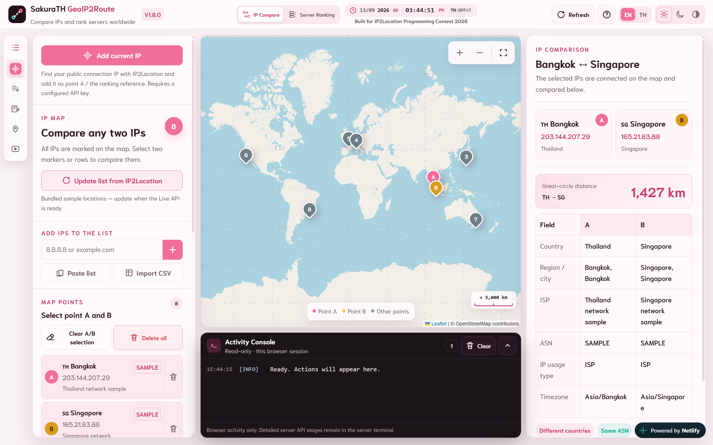
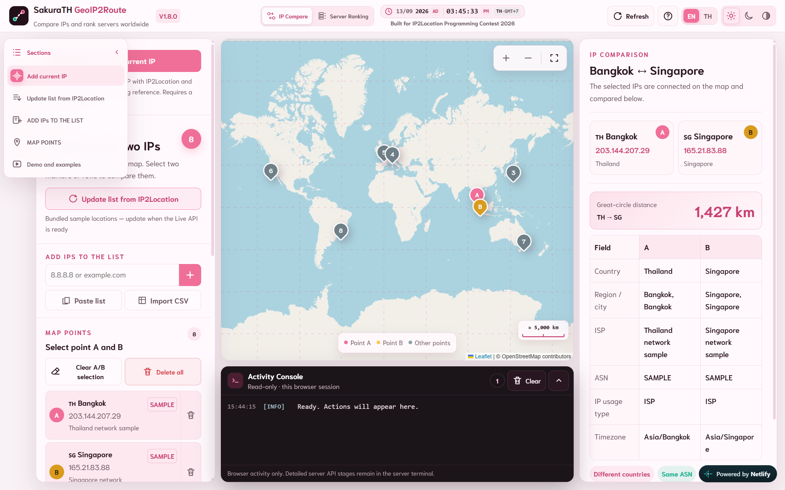
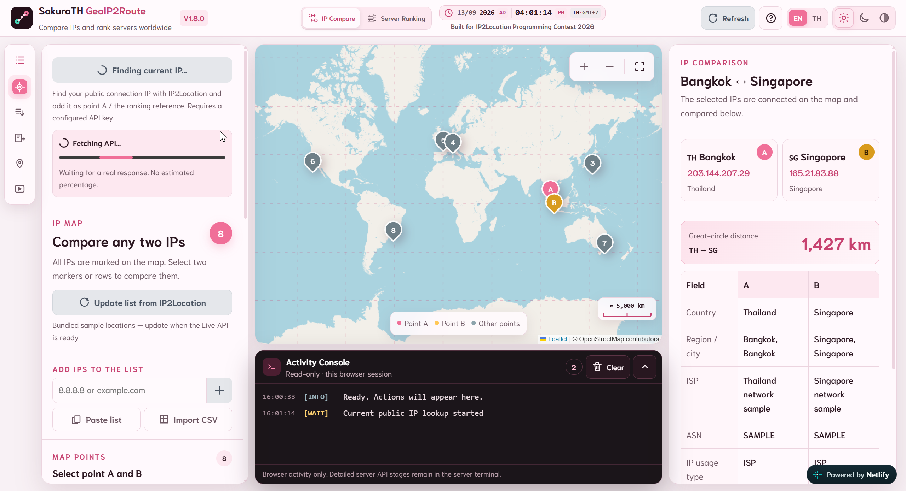
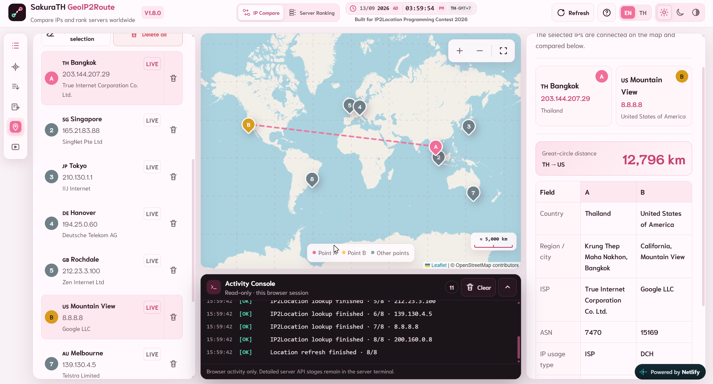
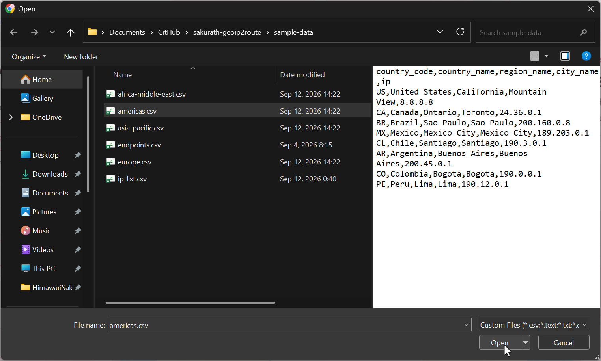
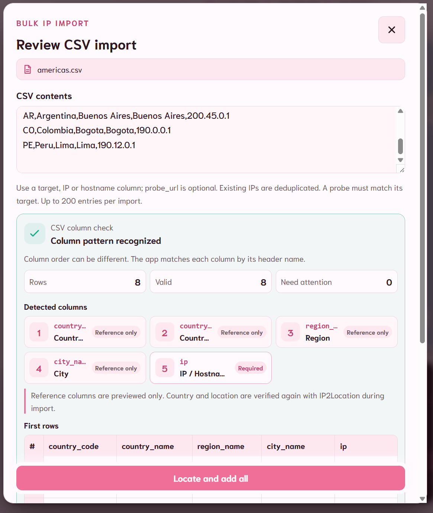
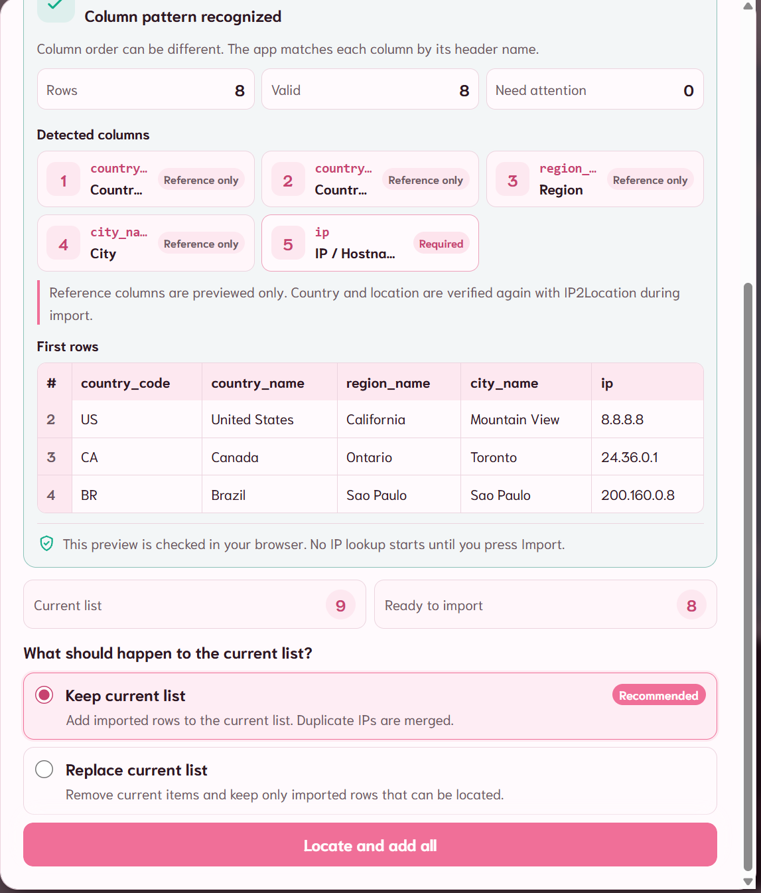
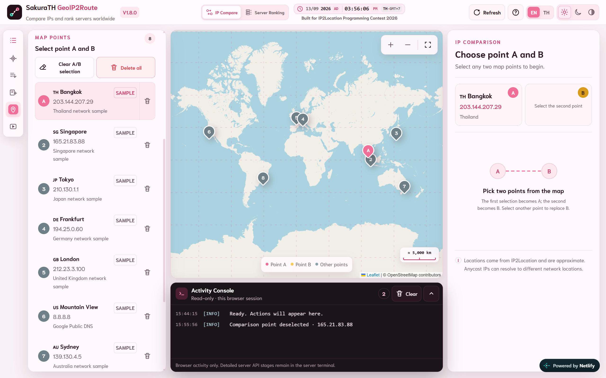
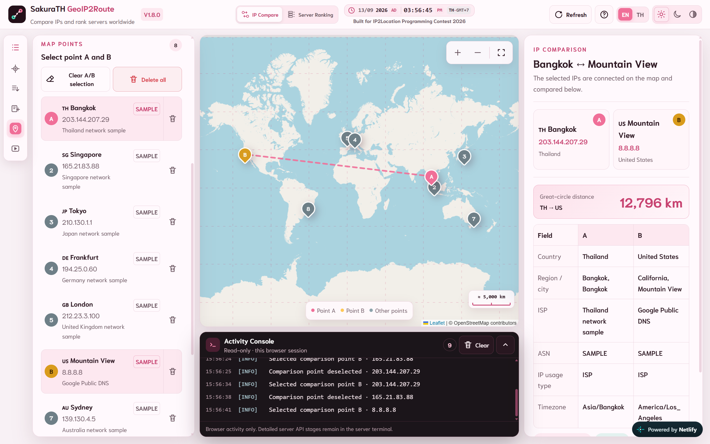
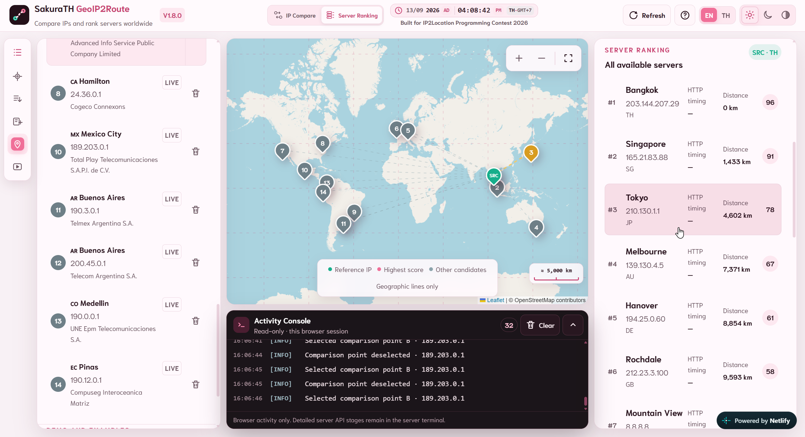

# SakuraTH GeoIP2Route user guide

[ภาษาไทย](USER-GUIDE.th.md) | [Project documents](README.md)

This guide explains the main tasks in SakuraTH GeoIP2Route. The screenshots show version `v1.8.0`. Live IP data, times, and scores may be different when you use the application.

- Live application: <https://sakurath-geoip2route.netlify.app/>.
- Source repository: <https://github.com/timor2542/sakurath-geoip2route>.

## 1. What the application does

SakuraTH GeoIP2Route has two main modes:

- **IP Compare** compares two IP locations, named A and B. It shows their direct map distance and their location and network details.
- **Server Ranking** uses one IP as a geographic reference (`SRC`) and ranks the other points as server candidates. It can use geographic fit or browser HTTP timing.

The application uses IP2Location results as location and network evidence. It does not run traceroute, ICMP ping, automatic routing, failover, or load balancing. Lines on the map connect locations; they are not packet routes.

## 2. Understand the workspace



*Figure 1. The IP Compare workspace on a desktop screen.*

The workspace has four main areas:

| Area | Purpose |
|---|---|
| Header | Switch mode, read the reference time, refresh the page, open Help, change language, and select a theme |
| Left panel | Add, update, import, select, or delete IP points |
| Center | View the map, geographic links, grid, scale, and Activity Console |
| Right panel | Read the selected comparison or ranking result |

Map and list symbols:

| Symbol | Meaning |
|---|---|
| Pink `A` | First point in IP Compare |
| Yellow `B` | Second point in IP Compare |
| Green `SRC` | Geographic reference in Server Ranking |
| Gray numbered marker | Another IP point or its current rank |
| `LIVE` | Data returned by a live lookup |
| `SAMPLE` | Bundled sample data |

## 3. Use quick navigation and display controls



*Figure 2. Expand the Sections rail to read each shortcut name.*

The narrow rail at the far left gives quick access to the long control panel. Select the first menu icon to expand or collapse its labels. The remaining icons jump to:

1. Add current IP
2. Update list from IP2Location
3. Add IPs to the list
4. Map points
5. Demo and examples

The active section is highlighted. A shortcut scrolls only the left panel; it does not change the points or the current result.

Other header controls:

- **IP Compare / Server Ranking** changes the working mode.
- **Refresh** reloads the application. It is different from **Update list from IP2Location**, which looks up the points again.
- **EN / TH** changes the interface language.
- The sun, moon, and half-filled circle select Light, Dark, and Automatic themes.
- The clock follows point A in IP Compare and `SRC` in Server Ranking. Without a selection, it uses the first point or the device clock.

## 4. Build the IP list

### 4.1 Add the current public IP

Select **Add current IP**. The application finds the public connection IP, requests its information, and adds or updates the matching point. It also selects the result as A in IP Compare and as `SRC` in Server Ranking.



*Figure 3. Controls stay disabled while the current-IP request is in progress.*

Wait for a success or error message before starting another lookup. If the request fails, the application reports the error and does not create estimated data.

### 4.2 Add one public IP or hostname

1. Go to **ADD IPs TO THE LIST**.
2. Enter a public IPv4 address, IPv6 address, or hostname.
3. Select `+` or press Enter.
4. Wait until the new or updated point appears in the list and on the map.

Examples: `8.8.8.8`, `2606:4700:4700::1111`, and `example.com`.

The application rejects local, private, and reserved IP addresses. If two hostnames resolve to the same IP, it keeps one point and updates its data.

### 4.3 Paste several targets

1. Select **Paste list**.
2. Enter one IP address or hostname per line.
3. Review the current and incoming counts.
4. Choose whether to keep or replace the current list.
5. Start the lookup.

Lines beginning with `#` are comments. Duplicate targets are merged before lookup.

```text
8.8.8.8
1.1.1.1
example.com
2606:4700:4700::1111
```

### 4.4 Update all points

Select **Update list from IP2Location** to request fresh information for the current points. The button shows progress, and the Activity Console records each result.



*Figure 4. A completed update changes successful rows to LIVE and shows the returned network provider.*

An update keeps the working list. A failed item remains visible so that one request does not remove the complete list.

## 5. Import a CSV file

### 5.1 Choose a file

Select **Import CSV**, then choose a `.csv` or `.txt` file from your device.



*Figure 5. The repository includes CSV files in `sample-data` for testing the import flow.*

A minimal file needs one target column:

```csv
ip
8.8.8.8
1.1.1.1
```

Accepted target headers include `target`, `ip`, `ip_address`, `address`, `hostname`, and `host`. Column order can be different.

An optional HTTPS probe can be included for Browser HTTP ranking:

```csv
target,probe_url
dns.google,https://dns.google/resolve?name=example.com&type=A
```

The probe host must match the target in the same row. Other location columns are shown as reference information only; the live lookup provides the map location used by the application.

### 5.2 Review the structure



*Figure 6. No IP lookup starts while the browser is reviewing the file.*

Before importing, check:

- the file name and raw CSV text;
- Rows, Valid, and Need attention counts;
- the detected Target and optional Probe columns;
- the first rows in the preview; and
- any exact row message shown for invalid data.

The review can report missing or repeated headers, invalid targets, unmatched probe URLs, extra cells, or unclosed quotation marks. Correct the file and choose it again when any row needs attention.

### 5.3 Keep or replace the current list



*Figure 7. Keep current list is the recommended choice for normal imports.*

- **Keep current list** adds successful rows and merges duplicates.
- **Replace current list** removes the old items only after the new file produces successful results. If every lookup fails, the old list is kept.

Select **Locate and add all** to start. One import can contain up to 200 unique targets, and the file can be up to 1 MiB.

## 6. Compare two IP points

Select **IP Compare**, then select a marker on the map or a row under **MAP POINTS**.



*Figure 8. The first selection becomes A; the result panel waits for B.*

Select another point to make it B. Selecting a third point replaces B while A stays selected. Select the active A or B point again to remove that selection.



*Figure 9. A completed comparison connects A and B and fills the result panel.*

Read the result in this order:

1. Confirm the names, IP addresses, and A/B labels.
2. Read the great-circle distance. It is a direct geographic estimate, not network latency.
3. Compare country, region and city, ISP, ASN, IP usage type, and time zone.
4. Use the same/different indicators to find matching network properties quickly.

IP geolocation is approximate. An Anycast or CDN address may appear in a different location for another network.

## 7. Rank server candidates

Select **Server Ranking**, then choose a **Geographic reference IP**. The selected point becomes `SRC` and is not ranked as a candidate.



*Figure 10. Geographic ranking compares every candidate with the selected reference.*

### Geographic fit

Geographic fit combines distance and network preference. A nearer candidate usually gets a higher distance score. The result is a 0–100 comparison score, not a percentage or service guarantee.

```text
distance_score = clamp(100 - distance_km / 200.37, 0, 100)
Geographic fit = 80% distance_score + 20% network_preference
```

### Browser HTTP

Choose **Browser HTTP** to rank only candidates with a configured HTTPS probe. HTTP tests always start from the browser running the application; changing `SRC` does not move the test origin.

For each candidate:

1. Select its row.
2. Enter an HTTPS probe URL that allows cross-origin requests.
3. Save and measure the candidate, or run all configured probes.
4. Read the median successful HTTP time and the number of successful attempts.

The application sends three requests in sequence and stops each request after 4.5 seconds. It uses the median of successful results. A failed browser test does not prove that a server is offline because CORS, TLS, redirects, or the local connection can also cause failure.

For full formula details, see [ALGORITHM.md](ALGORITHM.md).

## 8. Use the map

- Select `+` or `−` to zoom.
- Select the corner-frame icon to fit all current points.
- Drag the map to move the view.
- Select a marker to view or select its point.
- Use the square grid to compare visual scale.
- Read the lower-right scale for the approximate distance represented by one grid cell. The value changes with zoom.

The map legend changes between IP Compare and Server Ranking. Comparison lines join A and B. Ranking lines join `SRC` and the candidates. Neither line represents network hops.

## 9. Read the Activity Console

The Activity Console records actions from the current browser session. Common labels are:

- `[INFO]` for a normal state change;
- `[WAIT]` for work in progress;
- `[OK]` for a completed action;
- `[ERROR]` for an action that could not finish; and
- `[DEMO]` for simulated example activity.

Open or collapse the console with its arrow. **Clear** removes console messages only; it does not remove IP points.

## 10. Export ranking results

Server Ranking can export JSON for complete structured details or CSV for spreadsheet analysis. The export includes rank, target, location, method, score, distance, HTTP evidence when available, network type, and score contributions.

Before sharing an export, check the reference IP and probe URLs because they may identify your connection or private test systems.

## 11. Clear or delete data

- **Clear A/B selection** keeps every point and removes only the comparison selection.
- The trash icon on a row asks before deleting one point.
- **Delete all** asks before removing all points and clears A/B, `SRC`, the selected server, and unfinished probe work.
- **Clear** in the Activity Console removes log messages only.
- Reloading the page resets the working list and browser measurements.

## 12. Mobile and keyboard use

On a narrow screen, the map appears first and the panels continue below it. Scroll within a panel when it has its own scrollbar.

- Tab moves keyboard focus through controls.
- Enter submits the add-IP form.
- Escape closes an idle dialog.
- Focus stays inside an open dialog until it closes.
- The interface follows the device setting for reduced motion.

## 13. Quick working sequence

For a normal comparison:

1. Add or import the required public targets.
2. Update the list if fresh IP2Location data is needed.
3. Select A and B in IP Compare.
4. Read the distance and network fields.
5. Open Server Ranking and choose `SRC` when candidate ranking is required.
6. Use Geographic fit, or configure valid HTTPS probes before using Browser HTTP.
7. Export and review the result before sharing it.

Remember that IP location, geographic distance, and browser HTTP time are different types of evidence. Use them together, but do not describe any one of them as the real packet route.
