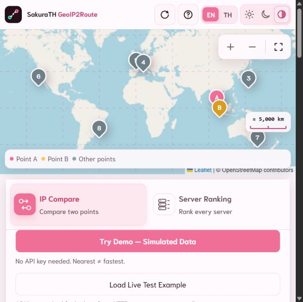
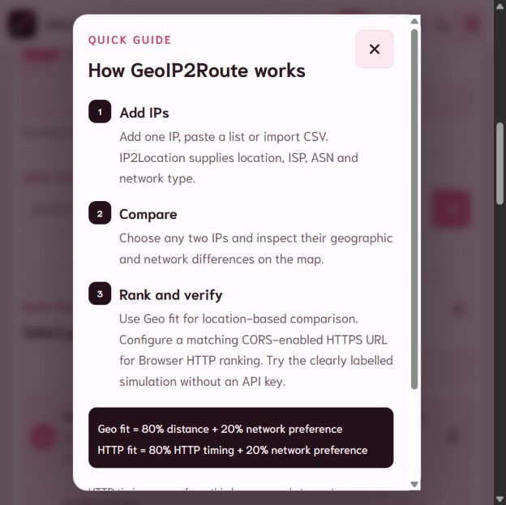
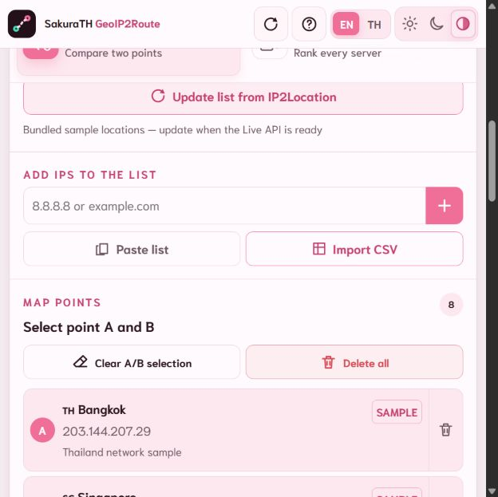
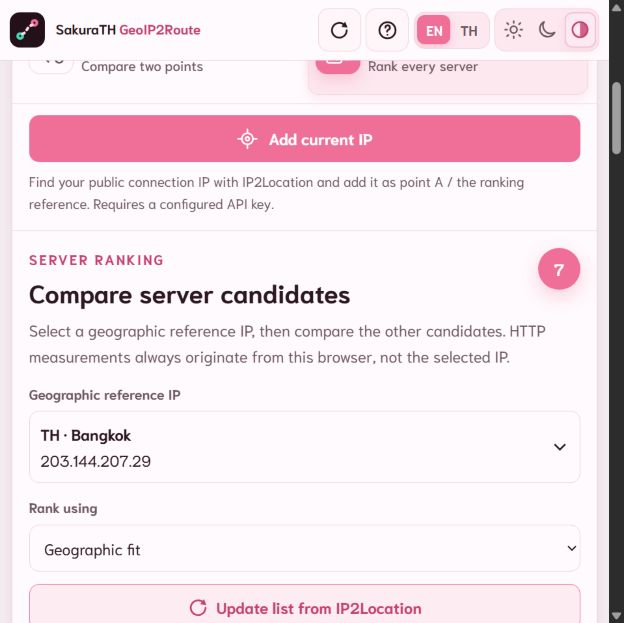

# คู่มือการใช้งาน SakuraTH GeoIP2Route

คู่มือนี้เป็นต้นฉบับคำอธิบายการใช้งาน และสามารถนำไปจัดทำสื่อประกอบด้วย Photoshop ได้ ควรบันทึกภาพหน้าจอจากแอปรุ่นเดียวกับเอกสาร เพื่อให้ชื่อปุ่ม ตัวเลข และลำดับหน้าจอสอดคล้องกัน

- แอปออนไลน์: <https://sakurath-geoip2route.netlify.app/>
- ซอร์สโค้ด: <https://github.com/timor2542/sakurath-geoip2route>
- เวอร์ชันเอกสาร: `v1.8.0`

## 1. แอปนี้ใช้ทำอะไร

SakuraTH GeoIP2Route ใช้ข้อมูลตำแหน่ง IP จาก IP2Location เพื่อทำงานหลักสองแบบ:

1. **IP Compare** — เลือก IP สองจุดเป็น A และ B แล้วเปรียบเทียบระยะทาง ประเทศ เมือง ISP, ASN, ประเภทเครือข่าย และเขตเวลา
2. **Server Ranking** — เลือก IP หนึ่งจุดเป็นตำแหน่งอ้างอิง แล้วจัดอันดับจุดอื่นในรายการเป็นเซิร์ฟเวอร์ที่เป็นตัวเลือก พร้อมแสดงหลักฐานที่สามารถตรวจสอบได้

แอปมิใช่เครื่องมือ Traceroute, ICMP Ping, Load Balancer หรือระบบตัดสินใจย้ายการรับส่งข้อมูลโดยอัตโนมัติ เส้นบนแผนที่แสดงความสัมพันธ์ทางภูมิศาสตร์ มิใช่เส้นทางจริงของแพ็กเก็ต

> **ข้อความสั้นสำหรับภาพเปิด:** เปรียบเทียบตำแหน่ง IP และจัดอันดับเซิร์ฟเวอร์ พร้อมแสดงที่มาของคะแนนอย่างโปร่งใส

## 2. ทำความรู้จักหน้าจอ

หน้าจอ Desktop แบ่งเป็นสี่ส่วนหลัก:

1. **แถบด้านบน** — โลโก้ วันและเวลาของประเทศอ้างอิง ปุ่ม Refresh, Help, ภาษา และธีม
2. **แถบด้านซ้าย** — เลือกโหมดและแสดงส่วนใช้งานหลักตามลำดับ ได้แก่ **Add current IP**, **Update list from IP2Location**, **ADD IPs TO THE LIST** และ **MAP POINTS** (หรือ **ALL IP POINTS** ในโหมดจัดอันดับเซิร์ฟเวอร์) ส่วนควบคุมสำหรับการสาธิตอยู่ท้ายแถบนี้
3. **แผนที่ตรงกลาง** — แสดงหมุด เส้น Grid มาตราส่วน และปุ่มซูม
4. **แถบด้านขวา** — แสดงผลเปรียบเทียบหรือผลจัดอันดับโดยละเอียด

ด้านล่างของแผนที่คือ **บันทึกกิจกรรม (Activity Console)** สำหรับตรวจสอบเหตุการณ์ที่เกิดขึ้นภายในเซสชันปัจจุบันของเบราว์เซอร์

เมนู **การนำทางด่วน** ซึ่งตรึงอยู่ด้านบนของแถบซ้ายมีตัวเลือกข้อความห้ารายการ ได้แก่ IP ปัจจุบัน ปรับปรุงข้อมูล เพิ่ม IP รายการจุด และส่วนสาธิต เมื่อเลือกชื่อ ระบบจะเลื่อนไปยังส่วนนั้นทันที จากนั้นเมนูจะกลับสู่ค่าเริ่มต้นเพื่อให้สามารถเลือกส่วนเดิมซ้ำได้

### ความหมายของสัญลักษณ์บนแผนที่

- `A` สีชมพู: จุดแรกในการเปรียบเทียบ
- `B` สีเหลือง: จุดที่สองในการเปรียบเทียบ
- `SRC` สีเขียว: IP อ้างอิงในโหมดจัดอันดับ
- `1`, `2`, `3`, ...: อันดับของเซิร์ฟเวอร์
- หมุดสีเทา: จุดอื่นที่ยังไม่ได้เลือก
- `LIVE`: ข้อมูลที่ค้นหาจาก IP2Location
- `SAMPLE`: ข้อมูลตัวอย่างที่รวมมากับโครงการ
- `SIMULATED`: ข้อมูลจำลองสำหรับสาธิตความแตกต่างของหลักฐาน

> **ภาพที่ควรถ่าย 1 — ภาพรวมแอป:** ใช้หน้าจอเดสก์ท็อปแนวนอน โดยให้เห็นเมนู “การนำทางด่วน” แถบด้านซ้าย แผนที่ แถบด้านขวา และบันทึกกิจกรรมภายในภาพเดียว พร้อมใส่หมายเลขกำกับส่วนประกอบ และแสดงลำดับในแถบซ้ายตั้งแต่ Add current IP ถึง Map Points



*ภาพอ้างอิง — บนหน้าจอแคบ แผนที่จะปรากฏก่อน และแผงควบคุมจะเรียงต่ออยู่ด้านล่าง*

## 3. วัน เวลา ภาษา และธีม

เวลาบนหัวแอปอ้างอิงเขตเวลาของจุดที่กำลังใช้งาน:

- โหมด **IP Compare** ใช้เขตเวลาของจุด A
- โหมด **Server Ranking** ใช้เขตเวลาของ `SRC`
- หากยังไม่มีการเลือก ระบบจะใช้จุดแรกในรายการ และใช้เวลาของอุปกรณ์เมื่อไม่มีข้อมูลของจุด

ภาษาไทยแสดงเวลาแบบ 24 ชั่วโมงและใช้ พ.ศ. โดยวาง `พ.ศ.` ไว้หน้าปี ส่วนภาษาอังกฤษแสดงเวลาแบบ 12 ชั่วโมงพร้อม AM/PM และใช้ `AD`

ปุ่มธีมมีสามแบบ:

- รูปดวงอาทิตย์: รูปแบบสว่าง
- รูปดวงจันทร์: รูปแบบมืด
- วงกลมครึ่งสี: รูปแบบอัตโนมัติ ซึ่งเปลี่ยนตามเวลาของอุปกรณ์

ระบบจะจดจำการเลือกภาษา รูปแบบสี และสถานะเปิดหรือปิดบันทึกกิจกรรมไว้ในเบราว์เซอร์

> **ภาพที่ควรถ่าย 2 — ส่วนหัว:** ตัดภาพเฉพาะส่วนหัวของแอป โดยให้เห็นวัน เวลา รหัสประเทศ เขตเวลา ปุ่ม EN/TH และปุ่มรูปแบบสี พร้อมเพิ่มลูกศรอธิบายว่าเวลาอ้างอิงจาก A หรือ `SRC`

## 4. เริ่มทดลองอย่างรวดเร็ว

เมื่อเปิดแอปครั้งแรกจะมีตำแหน่งตัวอย่าง 8 จุด สามารถเลือกหมุดและเปลี่ยนโหมดได้ทันที

ปุ่ม **Try Demo — Simulated Data** จะเพิ่มชุดข้อมูลจำลองและเปิดโหมด Server Ranking เพื่อแสดงว่า “เซิร์ฟเวอร์ที่อยู่ใกล้ที่สุด” อาจมิใช่ “เซิร์ฟเวอร์ที่ตอบสนองเร็วที่สุด” ระบบจะแสดงป้ายข้อมูลจำลองอย่างชัดเจนและไม่รวมข้อมูลดังกล่าวกับผลการตรวจวัดจริง

ปุ่ม **Load Live Test Example** จะเตรียมตัวอย่าง `target` และ `probe_url` ในหน้าต่างนำเข้า ผู้ใช้ยังคงต้องเริ่มค้นหาข้อมูลและตรวจวัด HTTP ด้วยตนเอง

ปุ่มสาธิตทั้งสองปุ่มอยู่ถัดจากส่วนควบคุม IP และรายการจุดที่ท้ายแถบด้านซ้าย ผู้ใช้สามารถเลื่อนภายในแถบดังกล่าวเพื่อเข้าถึงปุ่มได้



*ภาพอ้างอิง — หน้าต่างคู่มือภายในแอปสรุปขั้นตอนหลักสามขั้น โดยไม่เริ่มส่งคำขอค้นหาข้อมูลผ่าน API*

> **ข้อความสั้นสำหรับภาพ:** ทดลอง UI ได้ทันทีด้วยข้อมูลตัวอย่าง และแยกข้อมูลจำลองออกจากผลวัดจริงอย่างชัดเจน

## 5. เพิ่ม IP หนึ่งรายการ

### 5.1 เพิ่ม IP สาธารณะหรือชื่อโฮสต์

1. ไปที่หัวข้อ **ADD IPs TO THE LIST**
2. ระบุ IPv4 สาธารณะ, IPv6 หรือชื่อโฮสต์ เช่น `8.8.8.8`, `2606:4700:4700::1111` หรือ `example.com`
3. เลือกปุ่ม `+` หรือกด Enter
4. รอผลการค้นหาข้อมูลจากแถบสถานะ
5. เมื่อสำเร็จ หมุดใหม่จะปรากฏบนแผนที่และรายการด้านซ้าย

หากชื่อโฮสต์ชี้ไปยัง IP ที่มีอยู่แล้ว ระบบจะปรับปรุงข้อมูลของจุดเดิมและไม่สร้างหมุดซ้ำ

ระบบไม่รับ Local/Private/Reserved IP, URL ที่มีชื่อผู้ใช้หรือรหัสผ่าน และค่าที่มี Port กำหนดเองในช่อง Target

### 5.2 เพิ่ม IP ปัจจุบัน

1. เลือก **Add current IP**
2. ระบบจะตรวจหา IP สาธารณะของการเชื่อมต่อที่ใช้เปิดแอป
3. IP ที่พบจะถูกเพิ่มหรืออัปเดตในรายการ
4. จุดดังกล่าวจะเป็น A ในโหมดเปรียบเทียบ และเป็น `SRC` ในโหมดจัดอันดับ

หาก API ข้อมูลจริงไม่พร้อมใช้งาน ระบบจะแสดงข้อผิดพลาดและจะไม่สร้างข้อมูลตำแหน่งขึ้นเอง

> **ภาพที่ควรถ่าย 3 — เพิ่ม IP:** ตัดภาพแถบด้านซ้ายตั้งแต่ปุ่ม Add current IP จนถึงช่องเพิ่ม IP พร้อมใส่หมายเลขกำกับช่องกรอก ปุ่ม `+` และข้อความสถานะ

## 6. วางรายการหลาย IP

1. เลือก **Paste list**
2. ระบุ IP หรือชื่อโฮสต์หนึ่งรายการต่อหนึ่งบรรทัด
3. ตรวจจำนวนรายการเดิมและรายการที่จะนำเข้า
4. เลือกวิธีรวมข้อมูล
5. เลือกปุ่มเพื่อเริ่มค้นหาข้อมูล

รองรับบรรทัดหมายเหตุที่ขึ้นต้นด้วย `#` และระบบจะรวมเป้าหมายที่ซ้ำกันก่อนเริ่มค้นหาข้อมูล โดยรองรับเป้าหมายสูงสุด 200 รายการต่อการนำเข้าหนึ่งครั้ง

ตัวอย่างรายการ:

```text
8.8.8.8
1.1.1.1
example.com
2606:4700:4700::1111
```

> **ภาพที่ควรถ่าย 4 — Paste list:** เปิดหน้าต่าง Paste list พร้อมข้อมูล 4 บรรทัด ให้เห็นจำนวน Current list, Incoming list และตัวเลือก Append/Replace

## 7. นำเข้า CSV



*ภาพอ้างอิง — ปุ่ม Import CSV อยู่ข้างปุ่ม Paste list การล้างรายการที่เลือกจะไม่ลบ IP ส่วนปุ่ม Delete all จะแสดงหน้าต่างยืนยันก่อนลบทั้งหมด*

### 7.1 รูปแบบขั้นต่ำ

ไฟล์ต้องมีคอลัมน์เป้าหมายอย่างน้อยหนึ่งคอลัมน์ โดยสามารถสลับลำดับคอลัมน์ได้ เนื่องจากระบบตรวจสอบจากชื่อหัวคอลัมน์

```csv
ip
8.8.8.8
1.1.1.1
```

ชื่อหัวคอลัมน์ที่ใช้เป็นเป้าหมายได้ ได้แก่

`target`, `ip`, `ip_address`, `address`, `hostname`, `host`

### 7.2 รูปแบบที่มี URL สำหรับตรวจวัด

```csv
target,probe_url
dns.google,https://dns.google/resolve?name=example.com&type=A
```

ชื่อหัวคอลัมน์สำหรับ URL ตรวจวัดที่รองรับ ได้แก่

`probe_url`, `probe`, `health_url`

URL สำหรับตรวจวัดเป็นข้อมูลที่ไม่บังคับ แต่ต้องใช้ HTTPS และชื่อโฮสต์ต้องตรงกับเป้าหมายของแถวดังกล่าว

### 7.3 คอลัมน์อ้างอิง

ระบบสามารถระบุบทบาทของคอลัมน์ต่อไปนี้เพื่อช่วยตรวจไฟล์:

- ประเทศ: `country_name`, `country`, `country_full_name`
- รหัสประเทศ: `country_code`, `country_short`, `country_iso`, `iso2`
- ภูมิภาค: `region_name`, `region`, `state`, `state_name`
- เมือง: `city_name`, `city`
- พิกัด: `latitude`/`lat` และ `longitude`/`lng`/`lon`
- เครือข่าย: `isp`, `isp_name`, `asn`, `as_number`, `usage_type`, `network_type`
- เขตเวลา: `timezone`, `time_zone`

คอลัมน์เหล่านี้ใช้เป็น **ข้อมูลอ้างอิงเท่านั้น** ข้อมูลตำแหน่งจริงจะมาจากผลการค้นหาเป้าหมาย ส่วนคอลัมน์ที่ระบบไม่รู้จักจะแสดงเป็น **ไม่นำเข้า**

### 7.4 ตรวจไฟล์ก่อนนำเข้า

1. เลือก **Import CSV** และเลือกไฟล์ `.csv` หรือ `.txt`
2. ระบบจะอ่านไฟล์ภายในเบราว์เซอร์ก่อน โดยยังไม่เริ่มค้นหาข้อมูล
3. ตรวจสอบสถานะ **ระบบรู้จักรูปแบบคอลัมน์**
4. ตรวจสอบส่วน **คอลัมน์ที่ตรวจพบ** ว่าคอลัมน์เป้าหมายและ URL สำหรับตรวจวัดได้รับการจับคู่อย่างถูกต้อง
5. ตรวจสอบจำนวนแถวทั้งหมด แถวที่ถูกต้อง และแถวที่ต้องแก้ไข
6. ตรวจสอบข้อมูลสามแถวแรกในตารางตัวอย่าง
7. หากมีปัญหา ระบบระบุหมายเลขแถวและปิดปุ่มนำเข้าไว้จนกว่ารูปแบบจะถูกต้อง

ระบบสามารถตรวจพบข้อผิดพลาด เช่น ไม่มีหัวคอลัมน์เป้าหมาย มีคอลัมน์เป้าหมายหรือ URL สำหรับตรวจวัดซ้ำ เป้าหมายหรือ URL ไม่ถูกต้อง ชื่อโฮสต์ไม่ตรงกัน จำนวนค่าเกินกว่าหัวคอลัมน์ หรือเครื่องหมายอัญประกาศปิดไม่ครบถ้วน

รองรับไฟล์ขนาดไม่เกิน 1 MiB และเป้าหมายที่ไม่ซ้ำกันสูงสุด 200 รายการต่อไฟล์

> **ภาพที่ควรถ่าย 5 — CSV ถูกต้อง:** ใช้ไฟล์ตัวอย่างที่มี `country_name,city_name,ip` โดยให้เห็นการจับคู่คอลัมน์ จำนวนแถว และข้อมูลตัวอย่างสามแถวแรก
>
> **ภาพที่ควรถ่าย 6 — CSV ไม่ถูกต้อง:** ใช้ไฟล์ที่มี Target ผิดหนึ่งแถว ให้เห็น Invalid rows และหมายเลขแถวที่ต้องแก้ ใช้สีแดงเฉพาะจุดผิด

### 7.5 เลือกว่าจะเก็บรายการเดิมหรือไม่

ในหน้าต่างนำเข้ามีสองตัวเลือก:

- **Append to current list — Recommended:** เก็บรายการเดิมและเพิ่มเป้าหมายใหม่ โดยระบบจะรวม IP ที่ซ้ำกันโดยอัตโนมัติ
- **Replace current list:** ใช้ผลนำเข้าชุดใหม่แทนรายการเดิมทั้งหมด

เมื่อเลือกแทนที่ ระบบจะแสดงคำเตือน หากการค้นหาข้อมูลชุดใหม่ไม่สำเร็จทุกรายการ ระบบจะยกเลิกการแทนที่และเก็บรายการเดิมไว้ เพื่อป้องกันข้อมูลสูญหายจากข้อผิดพลาดของ API หรือเครือข่าย

ระหว่างค้นหาข้อมูล ระบบจะแสดงความคืบหน้าทั้งแบบจำนวนและแถบสถานะ โดยประมวลผลพร้อมกันสูงสุดสามรายการ

> **ภาพที่ควรถ่าย 7 — ตัวเลือกนำเข้า:** เน้นวงรอบ Append และ Replace พร้อมข้อความสั้น “เก็บรายการเดิม” และ “แทนที่รายการเดิม”

## 8. เปรียบเทียบ IP สองจุด

1. เลือกแท็บ **IP Compare**
2. เลือกหมุดบนแผนที่หรือแถวใน **MAP POINTS** หนึ่งรายการ จุดนั้นจะเป็น A
3. เลือกอีกรายการ จุดนั้นจะเป็น B
4. หากเลือกจุดที่สาม ระบบจะแทนที่ B โดยคง A ไว้
5. ตรวจสอบเส้นเชื่อม A–B และผลการเปรียบเทียบด้านขวา

ผลลัพธ์ประกอบด้วย:

- Great-circle distance หรือระยะทางสั้นที่สุดบนผิวโลก
- Country
- Region / city
- ISP
- ASN
- IP usage type
- Timezone
- สรุปว่า Country, ASN และ Network type เหมือนหรือต่างกัน

ตำแหน่งทั้งหมดเป็นค่าประมาณจาก IP geolocation โดย Anycast IP อาจแสดงตำแหน่งเครือข่ายต่างกันได้

> **ภาพที่ควรถ่าย 8 — ผลเปรียบเทียบ:** เลือก Bangkok เป็น A และ Singapore เป็น B ให้เห็นหมุด เส้นเชื่อม การ์ด A/B ตัวเลขระยะทาง และตารางเปรียบเทียบ
>
> **คำกำกับภาพ:** เลือกสองจุดเพื่อเปรียบเทียบตำแหน่งและข้อมูลเครือข่ายแบบเคียงข้างกัน

## 9. จัดอันดับเซิร์ฟเวอร์



*ภาพอ้างอิง — เลือก IP อ้างอิงและวิธีจัดอันดับก่อนตรวจสอบผลของเซิร์ฟเวอร์ที่เป็นตัวเลือก*

### 9.1 เลือกตำแหน่งอ้างอิง

1. เลือกแท็บ **Server Ranking**
2. เลือก IP ที่ต้องการเป็น **Geographic reference IP**
3. จุดอ้างอิงจะแสดงเป็น `SRC` และจะไม่ถูกนำมาจัดอันดับเป็นเซิร์ฟเวอร์ที่เป็นตัวเลือก
4. IP อื่นทั้งหมดในรายการจะกลายเป็นตัวเลือกเซิร์ฟเวอร์

การเปลี่ยน `SRC` มีผลต่อระยะทาง แต่ไม่เปลี่ยนต้นทางของคำขอ HTTP เนื่องจากระบบตรวจวัดจากเบราว์เซอร์ที่เปิดแอปเสมอ

### 9.2 ความเหมาะสมเชิงภูมิศาสตร์

เลือก **Geographic fit** เมื่อต้องการจัดอันดับจากตำแหน่งและประเภทเครือข่าย

```text
Distance score = clamp(100 - distance_km / 200.37, 0, 100)
Geographic fit = 80% Distance score + 20% Network preference
```

คะแนนความเหมาะสมของเครือข่ายที่ใช้ในแอป

- DCH/CDN = 100
- ISP = 82
- MOB = 70
- อื่นหรือไม่ทราบ = 76

คะแนน 0–100 เป็นคะแนนเปรียบเทียบตามเกณฑ์ของผลิตภัณฑ์ มิใช่ค่าร้อยละหรือ SLA และไม่รับประกันประสิทธิภาพของเครือข่ายจริง

### 9.3 การตรวจวัด HTTP จากเบราว์เซอร์

เลือก **Browser HTTP** เมื่อต้องการจัดอันดับจากเวลาตอบสนองที่ตรวจวัดจริง

```text
HTTP score = clamp(100 - median_http_ms / 4, 0, 100)
Browser HTTP fit = 80% HTTP score + 20% Network preference
```

การกำหนด URL สำหรับตรวจวัด

1. เลือกเซิร์ฟเวอร์ที่เป็นตัวเลือกจากตารางด้านขวา
2. ระบุ URL ของปลายทางตรวจสอบสถานะหรือไฟล์ขนาดเล็กในช่อง **Candidate HTTPS probe URL**
3. URL ต้องใช้ HTTPS ชื่อโฮสต์หรือ IP ต้องตรงกับตัวเลือก ห้ามมีพอร์ตเฉพาะ ข้อมูลรับรอง หรือส่วน Fragment และเซิร์ฟเวอร์ต้องอนุญาต CORS
4. เลือก **Save & measure** หรือ **Measure now**
5. ดำเนินการซ้ำกับตัวเลือกอื่น หรือใช้ **Measure configured URLs** เพื่อตรวจวัด URL ที่พร้อมใช้งานทั้งหมด

ระบบจะส่งคำขอ GET ไปยังแต่ละตัวเลือกตามลำดับ 3 ครั้ง ใช้ค่ามัธยฐานของครั้งที่สำเร็จ และกำหนดเวลาสิ้นสุด 4.5 วินาทีต่อครั้ง การตรวจวัดจะสิ้นสุดเมื่อได้รับส่วนหัวการตอบกลับ จากนั้นระบบจะยกเลิกเนื้อหาการตอบกลับ เนื่องจากมิได้ทดสอบอัตราการรับส่งข้อมูล

หากตรวจวัดไม่สำเร็จ ระบบจะแสดงว่าไม่มีผลลัพธ์ และจะไม่สรุปว่าเซิร์ฟเวอร์หยุดให้บริการ เนื่องจาก CORS, TLS, การเปลี่ยนเส้นทาง หรือการเชื่อมต่อของเบราว์เซอร์อาจเป็นสาเหตุ

### 9.4 อ่านผลจัดอันดับ

การ์ด **RECOMMENDED SERVER** แสดง:

- ตัวเลือกที่ได้รับคะแนนสูงสุด
- คะแนนรวมและระดับ ดีเยี่ยม/ดี/ปานกลาง/ควรปรับปรุง
- เวลาตอบสนอง HTTP หรือสถานะยังไม่ได้ทดสอบ
- ระยะทางจาก `SRC`
- ประเภทเครือข่าย
- ประเภทหลักฐาน ได้แก่ ค่าประเมิน ผลตรวจวัด หรือข้อมูลจำลอง
- คะแนนจากแต่ละองค์ประกอบ
- เหตุผลที่ตัวเลือกนี้ได้รับอันดับหนึ่งและส่วนต่างจากอันดับสอง

ตาราง **SERVER RANKING** แสดงเซิร์ฟเวอร์ที่เป็นตัวเลือกทั้งหมดตามอันดับ เมื่อเลือกแต่ละแถว ระบบจะแสดง IP, ISP, ASN, เวลา ระยะทาง คะแนน และข้อมูล URL สำหรับตรวจวัดโดยละเอียด

> **ภาพที่ควรถ่าย 9 — ตั้งค่าการจัดอันดับ:** ให้เห็น `SRC` เกณฑ์การจัดอันดับ และตัวเลือกทั้งหมดบนแผนที่
>
> **ภาพที่ควรถ่าย 10 — เซิร์ฟเวอร์ที่แนะนำ:** ตัดภาพแถบด้านขวาให้เห็นคะแนนวงกลม องค์ประกอบของคะแนน และเหตุผลที่ตัวเลือกนี้ได้รับอันดับหนึ่ง
>
> **ภาพที่ควรถ่าย 11 — การตรวจวัด HTTP:** ระบุ URL สำหรับตรวจวัดที่ถูกต้องและแสดงผล `3/3` พร้อมค่ามัธยฐาน โดยระบุใต้ภาพว่า “ตรวจวัดจากเบราว์เซอร์ มิใช่ Ping”

## 10. ส่งออกผลลัพธ์

ในโหมด Server Ranking สามารถส่งออกผลลัพธ์ได้ดังนี้

- **Export JSON** สำหรับข้อมูลที่มีโครงสร้าง พร้อมรายละเอียดสูตรและองค์ประกอบ
- **Export CSV** สำหรับเปิดด้วยโปรแกรมตารางคำนวณ

ไฟล์ส่งออกประกอบด้วยอันดับ เป้าหมายหรือ IP ประเทศ เกณฑ์การจัดอันดับ คะแนน IP อ้างอิง ระยะทาง ประเภทและต้นทางการตรวจวัด ค่ามัธยฐาน HTTP จำนวนคำขอที่สำเร็จ เวลา UTC, URL สำหรับตรวจวัด และองค์ประกอบของคะแนน

ระบบจะป้องกันข้อมูล CSV ที่อาจถูกโปรแกรมตารางคำนวณตีความเป็นสูตรก่อนส่งออก

> **ภาพที่ควรถ่าย 12 — การส่งออก:** ตัดภาพปุ่ม Export JSON/CSV และวางตัวอย่างไฟล์ผลลัพธ์ไว้ข้างกัน

## 11. ใช้แผนที่

- `+` ซูมเข้า
- `−` ซูมออก
- ไอคอนมุมทั้งสี่ จัดให้ทุกจุดอยู่ในขอบเขตแผนที่
- เส้น Grid ช่วยอ่านสัดส่วนพื้นที่
- มาตรวัดมุมล่างขวาแสดงระยะทางโดยประมาณต่อหนึ่งช่อง Grid และเปลี่ยนตามระดับ Zoom
- เลือกหมุดเพื่อตรวจสอบชื่อเมือง IP และข้อมูลเครือข่าย

เส้นเชื่อมในโหมด Compare และ Ranking เป็นเส้นภูมิศาสตร์เท่านั้น ไม่แสดงจำนวน Hop หรือเส้นทาง Packet จริง

## 12. ล้างและลบข้อมูล

คำสั่งแต่ละแบบทำงานต่างกัน:

- **Clear A/B selection:** ล้างเฉพาะสถานะ A และ B แต่เก็บรายการ IP และหมุดทั้งหมด
- **ล้างบันทึกใน Activity Console:** ล้างเฉพาะข้อความกิจกรรม โดยไม่กระทบ IP หรือผลลัพธ์
- **ไอคอนถังขยะท้ายแถว:** เปิดหน้าต่างยืนยันเพื่อลบ IP รายการเดียว
- **Delete all:** เปิดหน้าต่างยืนยันเพื่อลบ IP และหมุดทุกจุด

หลังจากยืนยันการลบทั้งหมด ระบบจะล้าง A/B, `SRC`, ตัวเลือกที่เลือก และข้อมูล URL สำหรับตรวจวัดในพื้นที่ทำงานปัจจุบันด้วย

> **ภาพที่ควรถ่าย 13 — ยืนยันการลบ:** ให้เห็นจำนวนจุดที่จะลบ ปุ่มยกเลิก และปุ่มยืนยันที่มีสีเด่น จากนั้นยกเลิกการดำเนินการเพื่อเก็บข้อมูลตัวอย่างไว้

## 13. บันทึกกิจกรรม

บันทึกกิจกรรมจะแสดงเวลา ระดับเหตุการณ์ และข้อความ เช่น

- `[INFO]` การเลือก การล้าง หรือการเริ่มทำงานทั่วไป
- `[WAIT]` กำลังค้นหาข้อมูลหรือตรวจวัด
- `[OK]` ทำงานสำเร็จ
- `[ERROR]` ทำงานไม่สำเร็จหรือสำเร็จเพียงบางส่วน
- `[DEMO]` โหลดข้อมูลจำลอง

บันทึกดังกล่าวเป็นข้อมูลของเซสชันปัจจุบันในเบราว์เซอร์และใช้สำหรับอธิบายขั้นตอนเท่านั้น มิใช่บันทึกถาวรของเซิร์ฟเวอร์ ผู้ใช้สามารถยุบ ขยาย หรือล้างข้อความได้

> **ภาพที่ควรถ่าย 14 — บันทึกกิจกรรม:** แสดงตัวอย่าง WAIT, OK และ ERROR โดยปิดบังข้อมูลที่ไม่ควรเปิดเผย

## 14. การใช้งานบนมือถือและการเข้าถึง

- บนหน้าจอแคบ แผนที่จะอยู่ด้านบนและแผงข้อมูลจะเรียงต่อกันลงมา
- ปุ่มหลักมีชื่อที่โปรแกรมอ่านหน้าจอสามารถเข้าถึงได้ และมีคำอธิบายเมื่อชี้เมาส์
- ใช้แป้น Tab เพื่อเลื่อนจุดโฟกัสระหว่างส่วนควบคุม
- กด Enter เพื่อส่งแบบฟอร์มเพิ่ม IP
- กด Escape เพื่อปิดกล่องโต้ตอบที่ไม่ได้อยู่ระหว่างการประมวลผล
- ระบบจะจำกัดจุดโฟกัสให้อยู่ภายในกล่องโต้ตอบจนกว่าจะปิด
- แอปรองรับการตั้งค่าลดการเคลื่อนไหวของระบบ

ควรทดสอบด้วยขนาดหน้าจออุปกรณ์เคลื่อนที่อย่างน้อยหนึ่งขนาด และตรวจสอบทั้งภาษาอังกฤษ ภาษาไทย รูปแบบสว่าง และรูปแบบมืด ก่อนจัดทำคู่มือฉบับสมบูรณ์

## 15. ชุดข้อความสั้นสำหรับวางบนภาพ

- **ภาพรวม:** Compare IP locations and rank server candidates in one workspace.
- **เพิ่ม IP:** เพิ่ม IP สาธารณะ, IPv6 หรือชื่อโฮสต์ แล้วใช้ IP2Location เพื่อค้นหาข้อมูลตำแหน่ง
- **CSV:** ตรวจสอบหัวคอลัมน์ การจับคู่คอลัมน์ และแถวที่ไม่ถูกต้องก่อนเริ่มค้นหาข้อมูล
- **รูปแบบการนำเข้า:** เลือกเพิ่มข้อมูลต่อจากรายการเดิม หรือแทนที่รายการเดิมอย่างปลอดภัย
- **การเปรียบเทียบ:** เลือก A และ B เพื่อเปรียบเทียบตำแหน่งและข้อมูลเครือข่าย
- **การจัดอันดับ:** เลือก `SRC` แล้วตรวจสอบคะแนนและหลักฐานของตัวเลือกทั้งหมด
- **HTTP:** ตรวจวัดการตอบกลับ HTTPS จากเบราว์เซอร์ 3 ครั้งและใช้ค่ามัธยฐาน
- **แผนที่:** เส้นกริดและมาตราส่วนจะเปลี่ยนตามระดับการซูมเพื่อช่วยอ่านระยะทาง
- **การลบ:** การล้างรายการที่เลือกแตกต่างจากการลบ IP และการลบทุกครั้งจะแสดงหน้าต่างยืนยัน
- **ความถูกต้อง:** ตำแหน่ง IP เป็นค่าประมาณ และเส้นบนแผนที่มิใช่เส้นทาง Traceroute

## 16. ข้อจำกัดที่ควรระบุในคู่มือ

- ตำแหน่ง IP เป็นค่าประมาณ มิใช่ GPS
- Anycast/CDN อาจแปลงไปยังตำแหน่งเครือข่ายที่แตกต่างกัน
- ระยะทางวงกลมใหญ่มิใช่ระยะทางของเส้นทางเครือข่าย
- เวลา HTTP อาจรวม DNS, การเชื่อมต่อ, TLS, การประมวลผลของเซิร์ฟเวอร์ และการจัดลำดับงานของเบราว์เซอร์บางส่วน
- คะแนนเป็นเกณฑ์สำหรับช่วยเปรียบเทียบ มิใช่ SLA หรือคำสั่งกำหนดเส้นทางโดยอัตโนมัติ
- รายการและผลการตรวจวัดอยู่ภายในเซสชันของเบราว์เซอร์ และจะเริ่มต้นใหม่เมื่อโหลดหน้าเว็บใหม่
